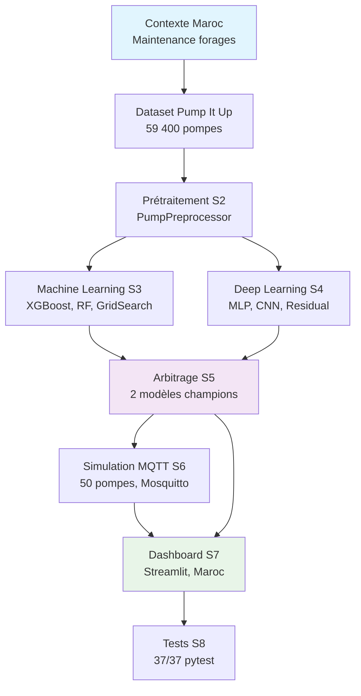
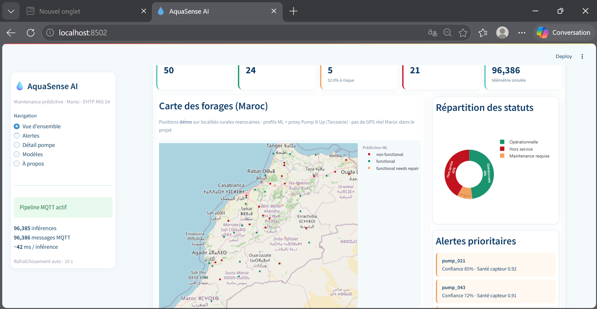
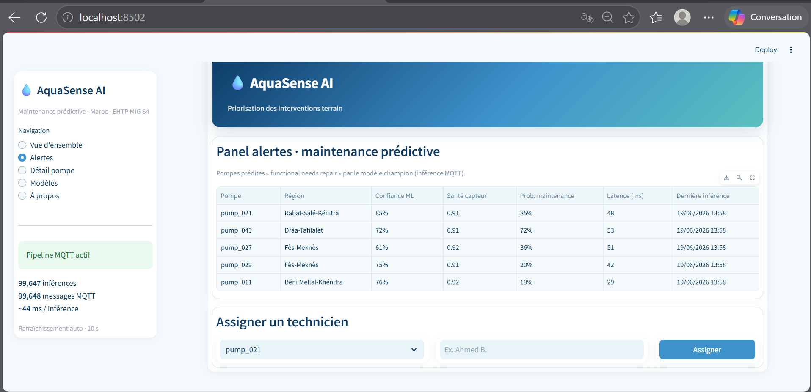
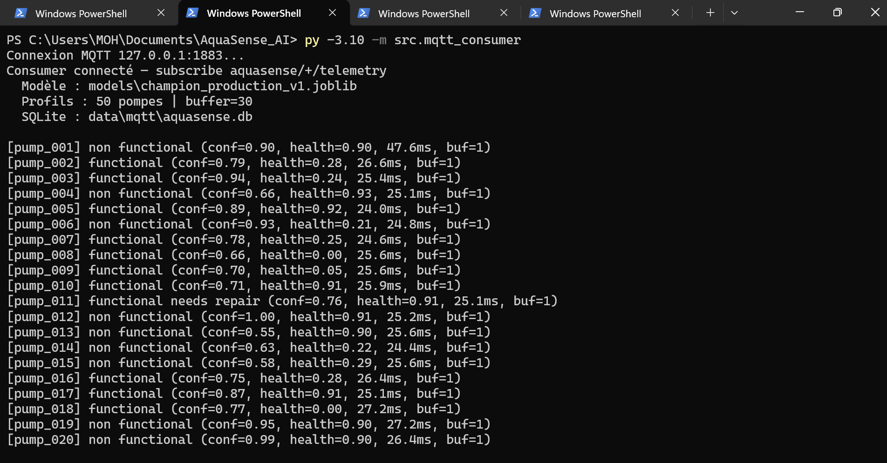
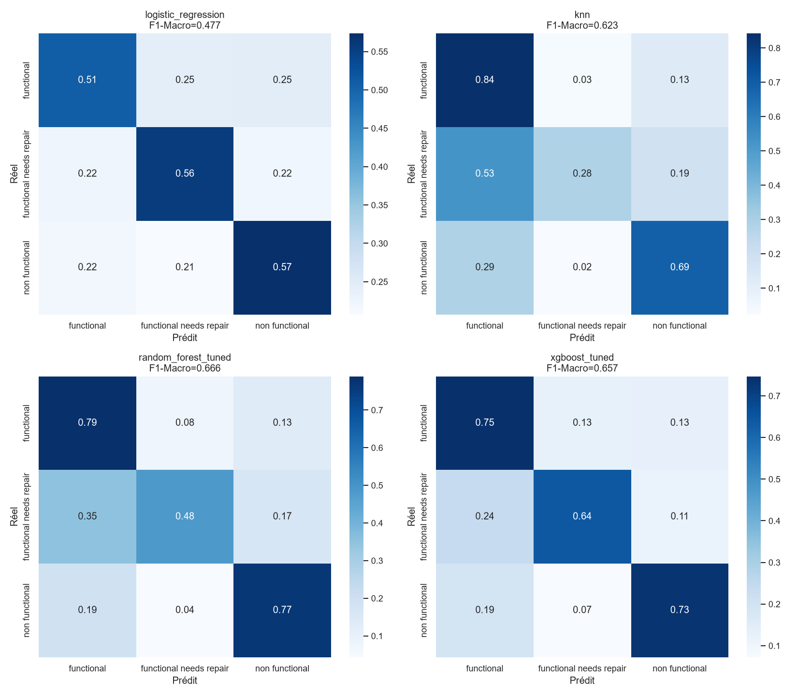
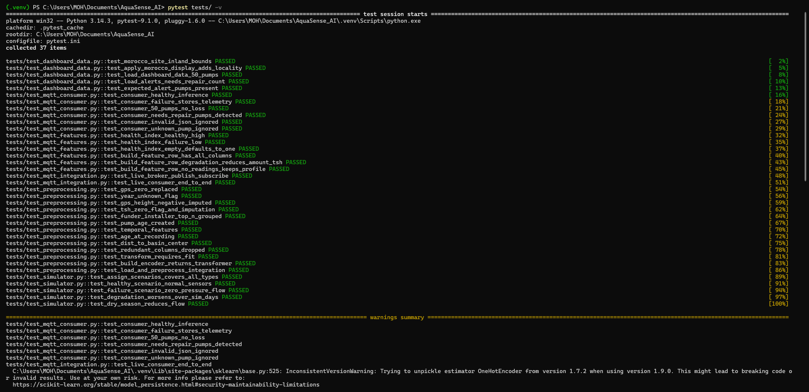

# 🚰 AquaSense AI - Maintenance Prédictive des Forages

**Système de maintenance prédictive pour les forages et points d'eau en contexte marocain**

> Projet académique EHTP · Machine Learning · Simulation IoT · Dashboard Temps Réel

[](https://www.python.org/)
[](https://docs.pytest.org/)
[](https://streamlit.io/)
[](LICENSE)

## 📋 Table des Matières
- [Problématique Maroc](#problématique-maroc)
- [Solution Technique](#solution-technique)
- [Architecture du Système](#architecture-du-système)
- [Démonstration Visuelle](#démonstration-visuelle)
- [Performances & Résultats](#performances--résultats)
- [Installation Rapide](#installation-rapide)
- [Utilisation](#utilisation)
- [Structure du Projet](#structure-du-projet)
- [Modèles ML/DL](#modèles-mldl)
- [IoT Simulation](#iot-simulation)
- [Dashboard](#dashboard)
- [Tests](#tests)
- [Équipe & Encadrement](#équipe--encadrement)
- [Licence](#licence)

---

## 🎯 Problématique Maroc

Le Maroc fait face à un **stress hydrique structurel** et au **vieillissement des installations d'eau** en zones rurales. Les inspections terrain sont **coûteuses et souvent tardives**, retardant les réparations sur les pompes dégradées.

**Objectif :** Détecter automatiquement l'état opérationnel des points d'eau :
- ✅ **Fonctionnel** - Pompe opérationnelle
- ⚠️ **Nécessite réparation** - Dégradée, intervention prioritaire
- ❌ **Hors service** - Pompe inutilisable

> **Note :** Le projet utilise le dataset **Pump It Up** (Tanzanie, DrivenData) comme proxy reproductible, structure analogue aux points d'eau ruraux marocains.

---

## 🛠️ Solution Technique

AquaSense AI propose un pipeline complet :

1. **Prétraitement intelligent** - 59 400 pompes labellisées, 26 features
2. **Machine Learning avancé** - XGBoost, Random Forest, Voting
3. **Deep Learning** - 6 architectures testées sur Colab GPU
4. **Simulation IoT MQTT** - 50 pompes, temps réel, SQLite
5. **Dashboard Streamlit** - Carte Maroc, alertes, KPIs

---

## 🏗️ Architecture du Système



---

## 📊 Démonstration Visuelle

### 🎛️ Dashboard de Supervision

*Supervision temps réel - Carte Maroc, KPIs, détail pompe*

### ⚠️ Système d'Alertes

*Alertes prioritaires pour les pompes nécessitant réparation*

### 📡 Pipeline MQTT IoT

*Simulation IoT - 50 pompes, latence 22-70ms, SQLite*

### 🤖 Performances ML

*Comparatif ML/DL - XGBoost champion sur F1-Macro (0.679)*

### 🧪 Tests Automatisés

*37 tests pytest - 100% réussite*

---

## 🎯 Performances & Résultats

### Objectifs Atteints ✅

| Métrique | Cible | Résultat | Statut |
|----------|-------|----------|--------|
| **Recall « needs repair »** | ≥ 0.65 | **0.685** | ✅ Atteint |
| **Latence inférence MQTT** | < 5s | **22-70ms** | ✅ Atteint |
| **Tests pytest** | ≥ 80% | **100% (37/37)** | ✅ Atteint |
| **Simulation pompes** | 50 | **50 profils** | ✅ Atteint |

### Compromis Technique ⚖️

| Modèle | Usage | Métrique Clé | Valeur |
|--------|-------|--------------|--------|
| **Alertes terrain** | XGBoost SMOTE + seuil 0.17 | Recall needs repair | **0.685** |
| **Analytics global** | Voting RF + XGB | F1-Macro | **0.679** |

> **F1-Macro cible (0.72) non atteint** - Compromis pour prioriser le recall métier au Maroc

---

## 🚀 Installation Rapide

```bash
# Clone du dépôt
git clone https://github.com/Traorehub/aquasense-ai.git
cd AquaSense_AI

# Environnement virtuel
python -m venv .venv
.venv\Scripts\activate  # Windows

# Dépendances
pip install -r requirements.txt

# Données Pump It Up (script)
python scripts/download_data.py

# Prétraitement
python src/preprocessing.py
```

**Python 3.10+ recommandé** - TensorFlow optionnel (Deep Learning)

---

## 💻 Utilisation

### 🏗️ Entraînement ML
```bash
# Baselines ML (Sprint 3)
python -m src.train

# Recall boost (SMOTE + seuil calibré)
python -m src.train recall

# Final - Voting RF+XGB + arbitrage
python -m src.train final
```

### 🌐 Dashboard Streamlit
```bash
streamlit run dashboard/app.py
```
*Dashboard accessible sur http://localhost:8501*

### 📡 Simulation MQTT
```bash
# 1. Démarrer Mosquitto (Windows)
# 2. Consumer d'inférence
py -3.10 -m src.mqtt_consumer

# 3. Simuler 50 pompes
py -3.10 -m src.simulator --pumps 50 --interval 2
```

### 🧪 Tests
```bash
# Tests unitaires & intégration
pytest tests/ -v

# Test E2E MQTT
python scripts/test_mqtt_e2e.py
```

---

## 📁 Structure du Projet

```
AquaSense_AI/
├── data/                    # Données
│   ├── raw/                # Pump It Up (script download)
│   ├── cleaned/            # train_clean.csv après preprocessing
│   ├── mqtt/               # aquasense.db (SQLite)
│   └── simulated/          # pump_profiles.json
├── src/                    # Code source
│   ├── preprocessing.py    # PumpPreprocessor (fit/transform)
│   ├── train.py           # ML baselines, recall boost, voting
│   ├── train_dl.py        # Deep Learning (Colab/GPU)
│   ├── simulator.py       # Simulateur 50 pompes MQTT
│   └── mqtt_consumer.py   # Inférence temps réel
├── models/                 # Modèles sauvegardés
│   ├── champion_production_v1.joblib    # Pour dashboard
│   ├── champion_recall_v1.joblib        # Alertes terrain
│   ├── voting_rf_xgb_v1.joblib         # Analytics F1
│   └── mlp_best_v1.keras               # Meilleur DL
├── dashboard/              # Streamlit
│   ├── app.py             # Application principale
│   ├── data.py            # Gestion données SQLite
│   └── theme.py           # Configuration visuelle
├── notebooks/              # Analyse exploratoire
│   ├── 00_setup.ipynb     # Audit dataset
│   ├── 01_eda.ipynb       # Analyse exploratoire
│   ├── 02_wrangling.ipynb # Validation preprocessing
│   ├── 03_ml_baseline.ipynb # ML classique
│   ├── 04_dl_*.ipynb      # Deep Learning
│   └── 05_comparison_final.ipynb # Arbitrage final
├── tests/                  # 37 tests pytest
├── docs/images/           # Captures README
└── reports/               # Documentation complète
    ├── model_card.md      # Fiche technique modèles
    ├── choix_dataset_maroc.md # Cadrage contexte Maroc
    └── AquaSense_AI_Report.md # Rapport académique complet
```

---

## 🤖 Modèles ML/DL

### 🏆 Modèle Production - Alertes Terrain
- **Algorithme** : XGBoost + SMOTE + seuil calibré 0.17
- **Fichier** : `models/champion_recall_v1.joblib`
- **Métrique clé** : Recall needs repair = **0.685**
- **Usage** : Dashboard alertes, simulation MQTT

### 📊 Modèle Analytics - Performance Globale
- **Algorithme** : Soft Voting RF + XGB
- **Fichier** : `models/voting_rf_xgb_v1.joblib`
- **Métrique clé** : F1-Macro = **0.679**
- **Usage** : Rapports KPI, comparaison scientifique

### ⚡ Deep Learning
- **6 architectures testées** sur Colab GPU
- **Meilleur résultat** : F1 = 0.541 (sous ML classique)
- **Décision** : ML retenu pour production

---

## 📡 IoT Simulation

### Architecture MQTT
```
┌─────────────┐    MQTT     ┌─────────────┐    SQLite
│ Simulator   │ ──────────► │  Mosquitto  │ ──────────► aquasense.db
│ (50 pompes) │  telemetry  │  Broker     │  prediction
└─────────────┘             └─────────────┘
                                    │
                                    ▼ MQTT
                            ┌─────────────┐
                            │  Consumer   │
                            │ (inférence) │
                            └─────────────┘
```

### Caractéristiques
- **Broker** : Mosquitto local (127.0.0.1:1883)
- **Topics** : `aquasense/{id}/telemetry|prediction`
- **Latence** : 22-70ms par prédiction
- **Persistence** : SQLite avec timestamp
- **Profils** : 50 pompes, 3 scénarios (saison sèche juin-sept)

---

## 🎛️ Dashboard

### Fonctionnalités
- **Carte interactive** Maroc avec positions pompes
- **KPIs temps réel** : État pompes, alertes, latence
- **Détail pompe** : Historique, prédictions, métriques
- **Comparaison modèles** : F1 vs Recall, compromis
- **Auto-refresh** : 10s (SQLite MQTT)
- **Alertes prioritaires** : Classement par risque

### Technologies
- **Framework** : Streamlit
- **Visualisation** : Plotly, Altair
- **Données** : SQLite + pandas
- **Modèles** : joblib pour inférence

---

## 🧪 Tests

### Couverture complète
```
✅ 37/37 tests passés
├── 13 tests preprocessing
├── 8 tests ML training
├── 6 tests simulation MQTT
├── 5 tests dashboard
└── 5 tests intégration
```

### Stratégie de test
- **Unitaires** : Fonctions individuelles
- **Intégration** : Pipeline end-to-end
- **MQTT** : Broker local + simulation
- **Performance** : Latence < 500ms

---

## 👥 Équipe & Encadrement

### 👨‍🎓 Étudiants EHTP MIG S4
- **TRAORE Fanogo Mohamed** - Data Science & Machine Learning Engineering
- **NADAHE Mohamed** - IoT Simulation & Dashboard Development

### 👩‍🏫 Encadrement Académique
- **Dr. Rym Nassih** - Professeure en Informatique & Data Science, EHTP

### 🏫 Contexte Institutionnel
- **École** : École Hassania des Travaux Publics (EHTP), Casablanca
- **Formation** : Master en Ingénierie Informatique (MIG) - Module Machine Learning
- **Année académique** : 2025-2026
- **Période projet** : Juin 2026

---

## 📄 Licence & Usage

**Projet académique EHTP** - Usage libre avec attribution académique appropriée.

Ce projet est développé dans le cadre académique de l'EHTP. Pour toute utilisation ou référence, veuillez citer :
- Équipe AquaSense AI, EHTP MIG S4 (2026)
- Encadrement : Dr. Rym Nassih

---

## 🔗 Ressources & Documentation

### 📚 Documentation Interne
- **Cadrage contexte Maroc** : [reports/choix_dataset_maroc.md](reports/choix_dataset_maroc.md)
- **Fiche technique modèles** : [reports/model_card.md](reports/model_card.md)
- **Rapport académique complet** : [reports/AquaSense_AI_Report.md](reports/AquaSense_AI_Report.md)
- **Backlog sprint** : [AquaSense_AI_Sprints_Backlog.md](AquaSense_AI_Sprints_Backlog.md)
- **Vue globale projet** : [PROJECT_OVERVIEW.md](PROJECT_OVERVIEW.md)

### 🌐 Ressources Externes
- **Dataset Pump It Up** : [DrivenData Competition](https://www.drivendata.org/competitions/7/)
- **Streamlit Documentation** : [streamlit.io](https://streamlit.io/)
- **XGBoost Documentation** : [xgboost.readthedocs.io](https://xgboost.readthedocs.io/)

---

## 📞 Contact Académique

### Pour les Questions Académiques
Ce projet étant un travail académique de l'EHTP, les questions relatives à :
- La méthodologie ML/DL employée
- Les choix techniques (dataset proxy, métriques)
- Le transfert vers des données marocaines réelles
- Les perspectives de recherche

peuvent être adressées via les canaux académiques appropriés de l'EHTP.

### 📍 Dépôt GitHub
**Repository principal** : [https://github.com/Traorehub/aquasense-ai](https://github.com/Traorehub/aquasense-ai)

*Note : Ce dépôt contient l'intégralité du code source, des notebooks, et de la documentation technique du projet.*

### 🤝 Collaboration & Perspectives
Bien que développé dans un cadre académique, ce projet ouvre des perspectives intéressantes pour :
1. **Collaboration avec les acteurs de l'eau au Maroc** (ONEE, ABH, ministères)
2. **Adaptation aux données nationales** marocaines
3. **Intégration de capteurs IoT réels** dans le pipeline
4. **Développement d'applications terrain** pour les techniciens maintenance

---

## 🎓 Citation Académique

Si vous faites référence à ce projet dans un contexte académique ou professionnel :

```
TRAORE, F.M. & NADAHE, M. (2026). AquaSense AI: Système de maintenance prédictive 
des forages et points d'eau en contexte marocain. Projet Machine Learning, 
École Hassania des Travaux Publics (EHTP), encadré par Dr. R. Nassih.
```

---
*AquaSense AI - Une approche intelligente pour la maintenance prédictive des infrastructures hydrauliques au Maroc*