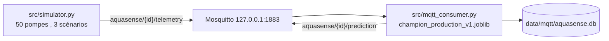

# AquaSense AI : Rapport de projet

**Maintenance prédictive des forages et points d'eau en contexte marocain**

---

| | |
|---|---|
| **Projet** | AquaSense AI |
| **Formation** | Projet Machine Learning  -  EHTP |
| **Établissement** | École Hassania des Travaux Publics (EHTP) |
| **Encadrement** | Dr. Rym Nassih |
| **Équipe** | TRAORE Fanogo Mohamed ,  NADAHE Mohamed |
| **Dépôt public** | <https://github.com/Traorehub/aquasense-ai> |

---

## Résumé exécutif

Le Maroc fait face à un stress hydrique structurel et au vieillissement des installations d'eau en zones rurales. Les inspections terrain sont coûteuses et souvent tardives, ce qui retarde les réparations sur les pompes dégradées. **AquaSense AI** propose un système complet de **maintenance prédictive** : classification automatique de l'état opérationnel d'un point d'eau en trois catégories (*fonctionnel*, *nécessite une réparation*, *hors service*), simulation IoT par MQTT, inférence temps réel et dashboard de supervision.

Le pipeline a été développé sur le benchmark international **Pump It Up** (59 400 pompes labellisées, Tanzanie, DrivenData), retenu comme jeu de données de référence faute de jeu de données marocain ouvert et reproductible à cette échelle. Le modèle de production (**XGBoost SMOTE + seuil calibré à 0,17**) atteint un **rappel (recall) de 0,685** sur la classe critique *functional needs repair* : objectif métier ≥ 0,65 atteint. Le **F1-Macro** maximal est de **0,679** (Soft Voting RF+XGB), légèrement sous la cible scientifique de 0,72. Le Deep Learning (6 architectures, tuning Colab GPU) n'a pas surpassé le ML classique (meilleur F1 DL = 0,541).

Le déploiement du prototype comprend une simulation MQTT de **50 pompes** (3 scénarios, saison sèche juin-septembre), un consumer d'inférence (**22-70 ms**), un dashboard Streamlit orienté Maroc et **37 tests pytest** (100 % de réussite). Le choix des métriques d'évaluation (F1-Macro, recall, et non l'accuracy ou la précision seules) est justifié en détail au chapitre 2.

**Mots-clés :** maintenance prédictive, forages, points d'eau, Maroc, Machine Learning, XGBoost, MQTT, Streamlit, métriques de classification, déséquilibre de classes.

---

## Table des matières

1. [Introduction et problématique](#1-introduction-et-problématique)
2. [Choix des métriques d'évaluation](#2-choix-des-métriques-dévaluation)
3. [Contexte marocain et choix du dataset proxy](#3-contexte-marocain-et-choix-du-dataset-proxy)
4. [Architecture globale du système](#4-architecture-globale-du-système)
5. [Sprint 0 : Setup et environnement](#5-sprint-0--setup-et-environnement)
6. [Sprint 1 : Acquisition et analyse exploratoire](#6-sprint-1--acquisition-et-analyse-exploratoire)
7. [Sprint 2 : Wrangling et feature engineering](#7-sprint-2--wrangling-et-feature-engineering)
8. [Sprint 3 : Machine Learning classique](#8-sprint-3--machine-learning-classique)
9. [Sprint 4 : Deep Learning et comparaison ML/DL](#9-sprint-4--deep-learning-et-comparaison-mldl)
10. [Sprint 5 : Arbitrage et modèles champions](#10-sprint-5--arbitrage-et-modèles-champions)
11. [Sprint 6 : Simulation IoT MQTT](#11-sprint-6--simulation-iot-mqtt)
12. [Sprint 7 : Dashboard de supervision](#12-sprint-7--dashboard-de-supervision)
13. [Sprint 8 : Tests et validation](#13-sprint-8--tests-et-validation)
14. [Limites, biais et perspectives](#14-limites-biais-et-perspectives)
15. [Conclusion](#15-conclusion)
16. [Références et reproduction](#16-références-et-reproduction)

---

## 1. Introduction et problématique

### 1.1 Contexte marocain

Le Maroc connaît une pression hydrique croissante : sécheresses récurrentes, baisse des nappes dans plusieurs bassins, et demande accrue en irrigation et en approvisionnement rural. Les **forages et points d'eau** constituent l'infrastructure de base pour des millions de personnes en zones rurales et périurbaines. Une pompe défaillante peut priver un douar entier d'eau potable pendant des semaines, avec des impacts sanitaires, agricoles et économiques majeurs.

Les acteurs institutionnels (ONEE, ABH) gèrent des milliers d'installations. Les inspections terrain restent néanmoins coûteuses, peu fréquentes et majoritairement réactives : on intervient après la panne plutôt qu'avant. La maintenance prédictive vise à prioriser les interventions sur les pompes à risque, en exploitant des données historiques et, à terme, des capteurs IoT (débit, pression, vibration).

### 1.2 Question de recherche

> *Peut-on prédire automatiquement l'état opérationnel d'un point d'eau (fonctionnel / dégradé / hors service) à partir de caractéristiques observables, avec un rappel suffisant sur la classe critique « nécessite une réparation » ?*

Cette question est **opérationnelle** (état de la pompe et du forage), et non hydrogéologique (niveau de nappe, salinité) : bien que ces dimensions soient centrales au Maroc et constituent une limite assumée du présent travail.

### 1.3 Objectifs du projet

| Objectif | Indicateur | Cible | Résultat final |
|----------|-----------|-------|----------------|
| Classification multi-classe équilibrée | F1-Macro | ≥ 0,72 | 0,679 (Voting RF+XGB) |
| Détection précoce maintenance | Recall *needs repair* | ≥ 0,65 | 0,685 (XGB SMOTE+seuil), objectif atteint |
| Pipeline temps réel | Latence inférence | < 5 s | 22-70 ms |
| Validation automatisée | Tests pytest | ≥ 80 % | 100 % (37/37) |
| Démo opérationnelle | Dashboard + MQTT | Fonctionnel | Réalisé |

*Les indicateurs F1-Macro et recall sont définis et justifiés au chapitre 2.*

### 1.4 Problem Statement (formulation du problème)

**Contexte :** Au Maroc, le stress hydrique et le vieillissement des forages ruraux rendent la maintenance préventive des pompes stratégique. Les données institutionnelles (ONEE, ABH) ne sont pas accessibles sous forme d'un jeu labellisé ouvert à grande échelle.

**Problème :** Comment identifier automatiquement les pompes dégradées nécessitant une intervention, à partir de caractéristiques structurelles (âge, type d'extraction, gestion, financement, localisation) ?

**Approche :** Développer et valider un pipeline ML reproductible sur le benchmark Pump It Up (structure analogue aux points d'eau ruraux), puis le déployer en simulation IoT avec supervision dashboard, en vue d'un transfert futur sur données nationales.

### 1.5 Contexte méthodologique

Les systèmes experts historiques (ex. MYCIN, années 1970) utilisaient des règles explicites codées par des experts. Sur des données tabulaires hétérogènes à grande échelle (59 400 enregistrements, 28 variables catégorielles), les approches **apprentissage automatique** surpassent les règles manuelles : les interactions entre financement, âge, gestion et géographie ne sont pas exhaustives à formaliser à la main. AquaSense AI adopte donc un paradigme **supervisé** (classification 3 classes) plutôt qu'un moteur de règles, tout en documentant les limites et les biais pour un usage responsable.

---

## 2. Choix des métriques d'évaluation

Ce chapitre justifie les indicateurs retenus pour juger les modèles. En classification supervisée, plusieurs scores sont possibles (accuracy, précision, rappel, F1). Nous expliquons pourquoi AquaSense AI s'appuie principalement sur le **F1-Macro** et le **recall** de la classe *functional needs repair*, et pourquoi les autres métriques, prises isolément, ne suffisent pas.

### 2.1 Le problème posé par nos données

Notre jeu comporte **trois classes** avec des effectifs très différents :

| Classe | Proportion |
|--------|------------|
| functional | 54,3 % |
| non functional | 38,4 % |
| functional needs repair | **7,3 %** |

La classe *needs repair* est la plus **rare** mais la plus **critique** pour la maintenance au Maroc : une pompe dégradée non détectée peut laisser un douar sans eau. Toute métrique qui ignore ce déséquilibre risque de valoriser un modèle qui prédit presque toujours « fonctionnel ».

### 2.2 Définitions (par classe)

Pour chaque classe, on compare les prédictions du modèle au label réel et on calcule :

| Métrique | Formule | Lecture métier |
|----------|---------|----------------|
| **Vrais positifs (VP)** | Prédit la classe et c'est correct | Bonne alerte ou bon diagnostic |
| **Faux positifs (FP)** | Prédit la classe à tort | Fausses alertes |
| **Faux négatifs (FN)** | N'a pas prédit la classe alors qu'elle est vraie | Pompe à risque **ratée** |
| **Précision** | VP / (VP + FP) | Parmi les alertes émises, combien sont justes ? |
| **Rappel (recall)** | VP / (VP + FN) | Parmi les vraies pompes à réparer, combien ont été trouvées ? |
| **F1-score (une classe)** | 2 × Précision × Rappel / (Précision + Rappel) | Compromis précision/rappel **pour cette classe seulement** |

### 2.3 F1-Macro : ce n'est pas « le » F1-score

**Point important :** le terme « F1-score » seul désigne le F1 **d'une classe**. Le **F1-Macro** est une **autre grandeur** : la moyenne des trois F1 par classe, **sans pondération** par l'effectif :

```
F1-Macro = (F1_functional + F1_needs_repair + F1_non_functional) / 3
```

| Terme | Signification |
|-------|---------------|
| F1-score (classe X) | Performance sur **une** classe |
| F1-Macro | Performance **globale équitable** sur les **trois** classes |

**Exemple chiffré** (champion recall, jeu de test 11 880 pompes) :

| Classe | Pompes (support) | F1 de la classe |
|--------|------------------|-----------------|
| functional | 6 452 | 0,76 |
| functional needs repair | 863 | 0,39 |
| non functional | 4 565 | 0,74 |
| **F1-Macro** | / | **(0,76 + 0,39 + 0,74) / 3 = 0,63** |

Un modèle peut donc avoir un bon rappel sur *needs repair* tout en affichant un F1-Macro plus modeste, car les trois classes entrent dans la moyenne.

### 2.4 Pourquoi nous n'avons pas retenu l'accuracy comme métrique principale

L'**accuracy** mesure la part de prédictions correctes sur l'ensemble des pompes :

```
Accuracy = (nombre de bonnes prédictions) / (total)
```

**Limite sur données déséquilibrées :** un modèle trivial qui répond toujours « functional » obtient environ **54 % d'accuracy** (la proportion de la classe majoritaire), tout en ratant **100 %** des pompes à réparer.

| Modèle naïf | Accuracy | Recall needs repair |
|-------------|----------|---------------------|
| Toujours « functional » | ~54 % | **0 %** |

Notre champion recall affiche une accuracy de 0,705, ce qui paraît correct, mais ce chiffre ne dit pas si les pompes dégradées sont bien détectées. Nous reportons l'accuracy en **complément**, jamais comme critère de sélection.

### 2.5 Pourquoi nous n'avons pas retenu la précision seule

La **précision** sur *needs repair* répond à : « Quand le modèle déclenche une alerte, a-t-il raison ? ». Maximiser uniquement la précision pousse à n'alerter que dans les cas quasi certains.

**Conséquence :** de nombreuses pompes réellement dégradées ne seraient pas signalées (rappel faible). Or, au Maroc, **manquer une dégradation** coûte souvent plus cher qu'une fausse alerte (déplacement technicien inutile).

Sur le champion recall, la précision sur *needs repair* est d'environ **0,28 à 0,40** : beaucoup de fausses alertes, assumées pour maintenir un rappel de **0,685**. La précision sert à **quantifier** ce compromis, pas à choisir seule le modèle.

### 2.6 Pourquoi nous n'avons pas retenu le recall seul

Le **rappel** sur *needs repair* répond à : « Parmi les vraies pompes à réparer, combien le modèle en trouve ? ». C'est central pour la maintenance, mais **insuffisant seul**.

**Contre-exemple observé en S4 (Deep Learning) :** un MLP tuné atteint un recall de **0,93** sur *needs repair*, mais :

| Métrique | Valeur |
|----------|--------|
| Recall needs repair | 0,93 |
| Accuracy | 0,38 |
| F1-Macro | 0,38 |

Le modèle classe presque tout en « à réparer » : utile pour illustrer le piège du recall isolé, **non déployable** en production. D'où le couplage avec le F1-Macro pour garder une vue sur les trois classes.

### 2.7 Synthèse : métriques retenues et rôle de chacune

| Métrique | Rôle dans le projet | Retenue comme objectif principal ? |
|----------|---------------------|-----------------------------------|
| **F1-Macro** | Comparer ML, DL et voting de façon équitable sur 3 classes | **Oui** (objectif scientifique ≥ 0,72) |
| **Recall *needs repair*** | Mesurer la détection des pompes dégradées (priorité terrain Maroc) | **Oui** (objectif métier ≥ 0,65) |
| Précision *needs repair* | Estimer le taux de fausses alertes | Non (complément) |
| Accuracy | Lecture globale intuitive | Non (complément) |
| F1 par classe | Diagnostiquer quelle classe est mal prédite | Non (analyse détaillée) |
| ROC-AUC macro | Capacité de séparation des classes | Non (complément) |

### 2.8 Deux objectifs, deux modèles champions (S5)

On ne peut pas maximiser simultanément F1-Macro et recall *needs repair* avec un **seul** seuil de décision :

| Stratégie | Effet |
|-----------|-------|
| Seuil bas (favoriser le recall) | Plus de pompes à risque détectées, plus de fausses alertes, F1-Macro en baisse |
| Seuil haut (favoriser la précision / F1 global) | Moins de fausses alertes, mais pompes dégradées ratées |

**Arbitrage retenu :**

| Usage | Modèle | Métrique clé | Valeur |
|-------|--------|--------------|--------|
| Alertes dashboard et MQTT | XGB SMOTE + seuil 0,17 | Recall needs repair | **0,685** (objectif atteint) |
| Comparaison scientifique / analytics | Voting RF + XGB | F1-Macro | **0,679** (écart −0,04 vs 0,72) |

Ce double choix n'est pas une contradiction : il reflète deux questions différentes (détection terrain vs performance globale sur trois classes).

### 2.9 Objectifs chiffrés et bilan

| Métrique | Seuil fixé | Résultat | Statut |
|----------|------------|----------|--------|
| F1-Macro | ≥ 0,72 | 0,679 (Voting RF+XGB) | Non atteint |
| Recall needs repair | ≥ 0,65 | 0,685 (XGB SMOTE + seuil) | Atteint |

L'écart sur F1-Macro (−0,04) est cohérent avec la littérature Pump It Up et avec le compromis volontaire du recall boost (SMOTE + abaissement du seuil de décision).

### 2.10 Explication de l'origine des seuils numériques (pourquoi 0,72, 0,65, etc.)

Les valeurs cibles ne sont pas tirées d'une norme ONEE ni d'un texte réglementaire marocain. Elles ont été **fixées au cadrage du projet** (Sprint 1, Problem Statement dans `notebooks/01_eda.ipynb`) et reprises dans le **backlog du projet** (`AquaSense_AI_Sprints_Backlog.md`, critères d'acceptation S3, S5 et S8). Elles servent de **références internes** pour juger si le pipeline est exploitable. A notre connaisance il n'en n'existe pas selon la strategie marocain ni selon des loi international de l'IA.

**Ces seuils sont-ils « arbitraires » ?** Non, au sens de valeurs choisies sans raison : chaque seuil répond à une **exigence formulée** (équilibre sur 3 classes, détection des pompes dégradées, temps réel MQTT, fiabilité des tests). En revanche, oui au sens où **personne ne nous a imposé** 0,72 ou 0,65 par une réglementation : ce sont des **critères d'acceptation du projet**, fixés par l'équipe avec l'encadrement au démarrage (S1), en s'appuyant sur (1) le déséquilibre des classes (7 % de *needs repair*), (2) les scores observés sur Pump It Up en littérature et dans nos baselines (~0,67 F1-Macro), et (3) la logique métier Maroc (priorité au rappel sur la classe rare). Les chiffres exacts **0,72** et **0,65** n'ont pas été déduits d'une formule unique ; ils traduisent un compromis **ambitieux mais atteignable** pour un projet de semestre. Seul le seuil **0,17** (décision recall boost) est **appris** sur les données, pas fixé à l'avance.

| Seuil | Valeur | D'où vient-il ? | Pourquoi cette valeur ? |
|-------|--------|-----------------|-------------------------|
| **F1-Macro** | ≥ 0,72 | Backlog S3/S5 + EDA §9 | Exiger une performance **équilibrée** sur les 3 classes, pas seulement sur la classe majoritaire. Le plaford observé en ML classique sur Pump It Up est d'environ **0,67** (RF tuned, S3). Le seuil **0,72** est donc **légèrement au-dessus** de ce que nous avons effectivement atteint en baseline, pour viser un modèle « bon » sans viser le niveau des gagnants DrivenData (> 0,80 avec feature engineering poussé). C'est un objectif **ambitieux mais réaliste** pour un projet de semestre. |
| **Recall *needs repair*** | ≥ 0,65 | Backlog S3/S5/S8 + EDA §9 | La classe critique ne représente que **7 %** des pompes. Détecter **65 %** des vraies pompes dégradées signifie en repérer environ **deux tiers** avant panne complète. Au Maroc, **rater une dégradation** (faux négatif) est plus coûteux qu'une fausse alerte (déplacement technicien inutile) : d'où un seuil de rappel **élevé** plutôt qu'un seuil de précision. La valeur **0,65** est aussi proche du recall natif du XGBoost tuned (**0,64**, S3) avant recall boost. |
| **Latence MQTT → prédiction** | < 5 s | Backlog S6 | Contrainte **temps réel** pour la démo IoT : le technicien doit voir une prédiction peu après la télémétrie. Nos mesures (**22-70 ms**) sont très en dessous de ce plafond. |
| **Latence inférence (unitaire)** | < 500 ms | Backlog S8-06 | Benchmark CPU local sur une pompe ; garantit que l'inférence n'est pas le goulot d'étranglement du pipeline. |
| **Tests pytest** | ≥ 80 % de réussite | Backlog S8 | Standard minimal de fiabilité logicielle pour un livrable reproductible. Nous avons atteint **100 %** (37/37). |
| **50 pompes simulées** | 50 | Backlog S6 | Charge de démonstration représentative (réseau rural) sans saturer un broker Mosquitto local en TP. |
| **Seuil décision recall boost** | 0,17 | **Appris** (S3/S5) | Ce n'est **pas** un objectif fixé à l'avance : il est **calibré** sur un hold-out 20 % du train pour maximiser le recall *needs repair* sous contrainte de F1 acceptable (`python -m src.train recall` puis `final`). |

**Synthèse :** les seuils **0,72** et **0,65** traduisent deux exigences complémentaires fixées dès le Problem Statement : un modèle **scientifiquement équilibré** (F1-Macro) et un modèle **orienté terrain** (recall sur la classe rare). Les autres seuils relèvent du backlog technique (MQTT, tests). Seul le seuil **0,17** est un paramètre **appris** pendant l'entraînement, pas une cible initiale.

---

## 3. Contexte marocain et choix du dataset proxy

### 3.1 Problème réel visé

AquaSense AI vise la maintenance prédictive des forages et points d'eau en contexte marocain : stress hydrique, vieillissement des installations rurales, coût des inspections terrain, besoin de **prioriser** les interventions sur les pompes « à risque ».

### 3.2 Comparaison données Maroc vs Pump It Up

| Critère | Données Maroc (ONEE, ABH) | Pump It Up (Tanzanie) |
|---------|---------------------------|------------------------|
| Volume labellisé | Fragmenté, sur demande | **59 400** pompes |
| Accès | Institutionnel, souvent payant | **Open data** (DrivenData) |
| Labels 3 classes | Rarement public | Oui |
| Reproductibilité | Difficile | Oui `download_data.py` |
| Structure (forage, pompe, gestion, GPS) | Analogue | Oui |

**Décision :** entraîner et valider sur Pump It Up, motiver par le contexte marocain, documenter les limites de transfert.

### 3.3 Analogie conceptuelle Maroc ↔ Tanzanie

| Concept | Maroc | Pump It Up |
|---------|-------|------------|
| Point d'eau rural | Douar, commune rurale | Village tanzanien |
| Forage / source | Nappe, borehole ONEE/ABH | `waterpoint_type`, `source_type` |
| Pompe | Manuelle, motorisée, solaire | `extraction_type` |
| Gestion | Association, commune, ABH | `management`, `payment` |
| Financement | État, coopérative, ONG | `funder`, `installer` |
| Usure | Âge, population desservie | `pump_age`, `population` |

### 3.4 Ce qui est conservé vs adapté

| Élément | Statut |
|---------|--------|
| Paradigme classification 3 classes | Oui |
| Pipeline preprocessing S2 | Oui |
| Métriques F1-Macro + Recall needs repair | Oui |
| Simulation MQTT + dashboard | Oui |
| Problem Statement | Oui Contexte Maroc |
| Carte dashboard | Oui Présentation Maroc (positions démo) |
| Saison simulation | Oui Juin–septembre (saison sèche Maroc) |

### 3.5 Phrase de cadrage

> *AquaSense AI répond à la problématique marocaine de maintenance des forages et points d'eau en zone rurale. Le pipeline prédictif est développé et benchmarké sur le jeu international Pump It Up, retenu pour sa richesse, ses labels et sa reproductibilité, en vue d'un déploiement futur sur des données nationales (ONEE, ABH, SNIE).*

---

## 4. Architecture globale du système

### 4.1 Pipeline de bout en bout

```
[Contexte Maroc : maintenance forages & points d'eau]
        │
        ▼
[Dataset proxy : Pump It Up : 59 400 pompes labellisées]
        │
        ▼
  S0 Setup ──► data/raw/*.csv
        │
        ▼
  S1 EDA ──► Anomalies, imbalance, Problem Statement
        │
        ▼
  S2 Wrangling ──► src/preprocessing.py ──► data/cleaned/
        │
        ├──────────────────┐
        ▼                  ▼
  S3 ML Classique    S4 Deep Learning
        │                  │
        └────────┬─────────┘
                 ▼
  S5 Arbitrage ──► champion_production_v1.joblib
                 │
                 ▼
  S6 MQTT ──► Simulateur → Mosquitto → Consumer → SQLite
                 │
                 ▼
  S7 Dashboard ──► Streamlit (carte Maroc, KPIs, alertes)
                 │
                 ▼
  S8 Tests ──► pytest 37/37
```

### 4.2 Stack technique

| Couche | Technologies |
|--------|-------------|
| Données | pandas, numpy, SQLite3 |
| ML | scikit-learn, XGBoost, imbalanced-learn, joblib |
| Deep Learning | TensorFlow/Keras |
| IoT simulé | paho-mqtt, Mosquitto, Faker |
| Dashboard | Streamlit, Plotly |
| Tests | pytest |

### 4.3 Structure du dépôt

```
AquaSense_AI/
├── PROJECT_OVERVIEW.md
├── README.md
├── requirements.txt
├── data/raw/              # NON versionné Git (~25 Mo)
├── data/cleaned/          # train_clean.csv, test_clean.csv
├── data/mqtt/             # aquasense.db
├── data/simulated/        # pump_profiles.json
├── src/                   # preprocessing, train, train_dl, simulator, mqtt_consumer…
├── models/                # .joblib, .keras
├── dashboard/             # app.py, data.py, theme.py
├── notebooks/             # 00_setup → 05_comparison_final
├── tests/                 # 37 tests pytest
├── scripts/               # download_data.py, test_mqtt_e2e.py
└── reports/               # rapports, graphiques, captures
```

---

## 5. Sprint 0 : Setup et environnement

### 5.1 Objectif

Mettre en place un environnement **reproductible** : structure dépôt, dépendances Python, accès au dataset, audit initial.

### 5.2 Livrables

| Livrable | Fichier |
|----------|---------|
| Structure projet | Dossiers data/, src/, notebooks/, dashboard/, tests/ |
| Dépendances | requirements.txt (versions pinnées) |
| Exclusion Git | .gitignore (data/raw, .venv, models, .env) |
| Téléchargement | scripts/download_data.py |
| Audit initial | notebooks/00_setup.ipynb |
| Documentation | README.md, PROJECT_OVERVIEW.md |

### 5.3 Environnement Python

```powershell
python -m venv .venv
.\.venv\Scripts\Activate.ps1
pip install -r requirements.txt
```

**Motivation des versions pinnées :** même environnement sur les deux machines de l'équipe et pour le correcteur ; évite qu'une mise à jour scikit-learn ou TensorFlow casse le pipeline entre sprints.

### 5.4 Dataset Pump It Up

| Fichier | Taille | Rôle |
|---------|--------|------|
| train_values.csv | 19,1 Mo | 59 400 × 40 features |
| train_labels.csv | 1,1 Mo | Labels status_group |
| test_values.csv | 4,8 Mo | 14 850 pompes (sans labels publics compétition) |

**Source :** [Pump It Up : DrivenData](https://www.drivendata.org/competitions/7/) : Taarifa + Tanzanian Ministry of Water.

### 5.5 Audit initial validé

| Dataset | Shape attendue | Shape obtenue |
|---------|---------------|---------------|
| train_values | (59 400, 40) | Oui (59 400, 40) |
| train_labels | (59 400, 2) | Oui (59 400, 2) |
| test_values | (14 850, 40) | Oui (14 850, 40) |

**Types :** 28 colonnes texte, 7 entiers, 3 float, 2 objet mixte.

**Distribution cible (découverte critique dès S0) :**

| Classe | Count | % |
|--------|-------|---|
| functional | 32 259 | 54,3 % |
| non functional | 22 824 | 38,4 % |
| functional needs repair | 4 317 | **7,3 %** |

**Valeurs manquantes notables :**

| Colonne | NaN | % |
|---------|-----|---|
| scheme_name | 28 810 | 48,5 % |
| scheme_management | 3 878 | 6,5 % |
| installer | 3 655 | 6,2 % |
| funder | 3 637 | 6,1 % |
| public_meeting | 3 334 | 5,6 % |

Ces constats alimentent directement le wrangling S2 et la stratégie d'imbalance S3.

---

## 6. Sprint 1 : Acquisition et analyse exploratoire

### 6.1 Objectif

Comprendre en profondeur le dataset : fusion train+labels, visualisations, catalogue d'anomalies, Problem Statement Maroc, stratégie d'imbalance.

### 6.2 Données clés confirmées

| Élément | Valeur |
|---------|--------|
| Shape train unifié | 59 400 × 41 |
| GPS invalides (longitude = 0) | 1 812 (3,0 %) |
| construction_year = 0 | 20 709 (34,9 %) |
| gps_height < 0 | 1 496 (2,5 %) |
| amount_tsh = 0 | 41 639 (70,1 %) |
| NaN scheme_name | 28 810 (48,5 %) |

### 6.3 Visualisations produites (12+ graphiques)

1. Heatmap de nullité
2. Barplot + pie chart distribution cible
3. 6 histogrammes numériques (amount_tsh, gps_height, population, construction_year, lon, lat)
4. 4 boxplots numériques par statut
5. 5 barplots catégoriels (top 10)
6. Barplot empilé statut par basin
7. Scatter map lat/lon coloré par statut (Tanzanie : données d'origine)
8. Heatmap corrélation numérique
9. Barplot enquêtes par année (2011–2013)
10. Année construction moyenne par statut
11. Histogramme âge pompe au survey par statut

Chaque graphique est commenté dans `notebooks/01_eda.ipynb`.

### 6.4 Stratégie d'imbalance (décision S1 → S3)

| Approche | Usage |
|----------|-------|
| class_weight='balanced' | Logistic Regression, Random Forest |
| sample_weight balanced | XGBoost |
| SMOTE (option) | Si recall needs repair < 0,65 |
| Métriques | F1-Macro ≥ 0,72 ,  Recall needs repair ≥ 0,65 |

**Justification :** avec 7,3 % de *needs repair*, l'accuracy seule est trompeuse ; la priorité métier Maroc est de ne pas rater les pompes dégradées.

### 6.5 Catalogue anomalies → actions S2

| Anomalie EDA | Traitement S2 |
|--------------|---------------|
| GPS = 0 | Centroïde basin/région |
| construction_year = 0 | Flag year_unknown + imputation médiane basin |
| gps_height < 0 | Imputation médiane basin |
| amount_tsh = 0 | Flag tsh_is_zero + imputation médiane positives |
| funder/installer haute cardinalité | Top-20 + « other » |
| Colonnes redondantes | Suppression (quantity_group, etc.) |

---

## 7. Sprint 2 : Wrangling et feature engineering

### 7.1 Objectif et livrables

Transformer 59 400 × 40 colonnes brutes en jeu propre 26 features + cible, reproductible via `PumpPreprocessor` (fit/transform).

| Livrable | Détail |
|----------|--------|
| src/preprocessing.py | Pipeline principal |
| data/cleaned/train_clean.csv | 59 400 × 37 colonnes |
| data/cleaned/test_clean.csv | 14 850 × 36 colonnes |
| tests/test_preprocessing.py | 13 tests unitaires Oui |

### 7.2 Pattern fit/transform : anti data leakage

```python
prep = PumpPreprocessor()
prep.fit(train_values)           # statistiques sur TRAIN uniquement
train_clean = prep.transform(train_values)
test_clean = prep.transform(test_values)
```

Les médianes, centroïdes GPS et top-20 funder/installer sont appris **uniquement** sur le train. Le même pipeline sert en inférence MQTT (S6).

### 7.3 Nettoyage détaillé

#### GPS invalides (longitude = 0)

- **Problème :** 1 812 pompes en mer (Golfe de Guinée), pas en Tanzanie
- **Solution :** remplacement par centroïde du **basin** (médiane lat/lon des pompes valides du même basin), sinon région, sinon médiane globale
- **Seuil :** |longitude| < 0,01 ou |latitude| < 0,01
- **Rejeté :** supprimer les lignes (perte 3 %) ; garder (0,0) (fausse la géographie)

#### construction_year = 0

- **Problème :** 34,9 % : code « année inconnue », pas l'an 0
- **Solution :** flag `year_unknown = 1`, imputation médiane du basin
- **Rejeté :** laisser 0 (pump_age absurde) ; supprimer 35 % des lignes

#### gps_height négatif

- **Problème :** 1 496 valeurs (ex. −21 m)
- **Solution :** NaN puis médiane basin
- **Rejeté :** clipper à 0 (perd l'information relative)

#### funder et installer (haute cardinalité)

- **Problème :** 1 896 funders, 2 145 installers
- **Solution :** lowercase + strip + top-20 + « other »
- **Rejeté :** one-hot sur 2000 catégories (overfitting)

#### amount_tsh = 0

- **Problème :** 70,1 % à zéro : pompe gravitaire légitime ou donnée manquante ?
- **Solution :** flag `tsh_is_zero = 1`, imputation médiane des valeurs strictement positives (~25 m)
- **Rejeté :** traiter tous les 0 comme manquants sans flag

#### Colonnes supprimées

| Colonne | Raison |
|---------|--------|
| quantity_group, extraction_type_group, waterpoint_type_group, quality_group | Redondantes (>89 % identiques) |
| region_code, district_code | Doublons numériques de region/district |
| recorded_by | Quasi-constant |
| scheme_name | >90 % vide |
| wpt_name, subvillage, ward, lga | Cardinalité extrême, identifiants locaux |

### 7.4 Feature engineering (8 features dérivées)

| Feature | Formule / logique | Motivation |
|---------|-------------------|------------|
| year_recorded, month_recorded, day_of_year | Extraites de date_recorded | Saisonnalité (sèche juin–sept pertinent Maroc) |
| pump_age | 2024 − construction_year | Usure actuelle |
| age_at_recording | year_recorded − construction_year | Âge au moment du survey (plus précis historiquement) |
| dist_to_basin_center | Haversine vers centroïde basin | Isolement géographique (moyenne 128,5 km) |
| year_unknown | Binaire si year = 0 | Donnée manquante informative |
| tsh_is_zero | Binaire si TSH = 0 | Pompe gravitaire vs imputation |

### 7.5 Encodage catégoriel (au moment de l'entraînement S3)

| Type | Colonnes | Encodage | Modèles |
|------|----------|----------|---------|
| Faible cardinalité | basin, water_quality, payment… | OneHotEncoder | Tous |
| Haute cardinalité | funder, installer, extraction_type, region | OrdinalEncoder | RF, XGBoost |
| Numériques | 15 + 2 binaires | StandardScaler (LR, KNN) / none (arbres) / MinMax (DL) | Selon modèle |

Les CSV nettoyés conservent les catégories en texte ; l'encodage est branché dans `build_encoder()` à l'entraînement.

### 7.6 Résultats finaux S2

| Métrique | Valeur |
|----------|--------|
| Lignes train | 59 400 |
| Features modèle | 26 |
| NaN restants | **0** |
| Tests unitaires | **13/13** |
| year_unknown = 1 | 20 709 (34,9 %) |
| tsh_is_zero = 1 | 41 639 (70,1 %) |
| pump_age moyen | 26,6 ans |
| dist_to_basin_center moyen | 128,5 km |

### 7.7 Ordre des opérations pipeline

```
_fix_gps → _fix_construction_year → _fix_gps_height → _fix_funder_installer
→ _fix_amount_tsh → _engineer_features → _encode_binary → _drop_columns
```

GPS corrigé **avant** dist_to_basin_center ; flags créés **avant** imputations.

---

## 8. Sprint 3 : Machine Learning classique

### 8.1 Objectif

Entraîner et comparer 4 baselines + GridSearch RF/XGB, établir la référence avant le Deep Learning, atteindre recall needs repair ≥ 0,65.

### 8.2 Protocole expérimental

| Paramètre | Valeur |
|-----------|--------|
| Données | data/cleaned/train_clean.csv |
| Features | 26 (PumpPreprocessor.get_feature_columns()) |
| Split | 80/20 stratifié, random_state=42 → 47 520 train / 11 880 test |
| Métrique principale | F1-Macro |
| Métrique métier | Recall functional needs repair |
| CV | 5-fold stratifiée sur le train |

### 8.3 Modèles et gestion du déséquilibre

| Modèle | Stratégie déséquilibre |
|--------|------------------------|
| Logistic Regression | class_weight='balanced' |
| Random Forest | class_weight='balanced' |
| KNN | Aucune (baseline géométrique) |
| XGBoost | sample_weight balanced |
| Recall boost | SMOTE (k=5) + seuil calibré sur hold-out 20 % train |

**Encodage XGBoost :** wrapper `XGBStringLabelPipeline` car XGBoost 3.x n'accepte pas labels string avec sample_weight.

### 8.4 Résultats : baselines + GridSearch

| Modèle | F1-Macro | F1 needs repair | Recall needs repair | Accuracy | ROC-AUC |
|--------|----------|-----------------|---------------------|----------|---------|
| **random_forest_tuned** 🏆 F1 | **0,6658** | 0,425 | 0,484 | 0,759 | 0,872 |
| xgboost_tuned | 0,6570 | 0,434 | 0,642 | 0,734 | 0,877 |
| xgboost | 0,6554 | 0,435 | 0,638 | 0,732 | 0,873 |
| knn | 0,6232 | 0,348 | 0,284 | 0,744 | 0,824 |
| logistic_regression | 0,4773 | 0,247 | 0,555 | 0,537 | 0,724 |

**GridSearch hyperparamètres retenus :**

```python
# RF (plateau : défauts optimaux)
{'clf__max_depth': None, 'clf__max_features': 'sqrt', 'clf__min_samples_leaf': 1}

# XGBoost
{'clf__colsample_bytree': 0.8, 'clf__learning_rate': 0.1,
 'clf__max_depth': 8, 'clf__subsample': 0.8}
```

### 8.5 Analyse par classe : RF champion F1

| Classe | Precision | Recall | F1 | Support test |
|--------|-----------|--------|-----|--------------|
| functional | 0,81 | 0,79 | 0,80 | 6 452 |
| functional needs repair | 0,38 | 0,48 | 0,43 | 863 |
| non functional | 0,78 | 0,77 | 0,77 | 4 565 |

Seulement **418/863** pompes needs repair correctement identifiées par le RF : d'où la passe recall boost.

### 8.6 Visualisations


*RF confond souvent needs repair avec functional. XGBoost détecte mieux la classe minoritaire mais avec plus de faux positifs.*


*Variables influentes : age_years, amount_tsh, longitude/latitude, installer, funder, extraction_type : cohérent avec l'intuition métier.*

### 8.7 Recall boost : critère métier atteint

Commande : `python -m src.train recall`

| Variante | F1-Macro | Recall needs repair | Seuil |
|----------|----------|---------------------|-------|
| **xgboost_smote_threshold** 🏆 | 0,6289 | **0,6952** | 0,16 |
| xgboost_threshold | 0,6392 | 0,6709 | 0,34 |
| random_forest_smote_threshold | 0,6317 | 0,6466 | 0,16 |
| xgboost_smote (sans seuil) | 0,6538 | 0,4519 | / |
| random_forest_smote | 0,6511 | 0,3975 | / |

**Enseignements :**

1. SMOTE seul ne suffit pas : recall baisse pour XGB (0,45)
2. Le **seuil calibré** est la clé
3. Champion métier : `champion_recall_v1.joblib` : détecte ~70 % des pompes à réparer

### 8.8 Constats S3

1. Plafond ~0,67 F1-Macro en ML classique sur Pump It Up : cohérent littérature
2. Conflit F1-Macro vs recall → deux champions distincts
3. LR inadaptée (F1 = 0,48) : conservée comme baseline interprétable
4. KNN : recall needs repair très faible (0,28)
5. F1 cible 0,72 reporté au S4 (DL)

---

## 9. Sprint 4 : Deep Learning et comparaison ML/DL

### 9.1 Objectif

Tester si le Deep Learning dépasse le plafond ~0,67 F1-Macro du ML et atteint F1 ≥ 0,72, tout en gardant recall ≥ 0,65.

### 9.2 Protocole

| Paramètre | Valeur |
|-----------|--------|
| Features DL | 64 dimensions (MinMax + OHE + Ordinal) |
| Split | 80/20 stratifié, random_state=42 |
| Architectures | MLP baseline, ResidualMLP, 1D-CNN, grid 9 configs |
| Class weights | {0: 0.614, 1: 4.586, 2: 0.868} |

### 9.3 Résultats : toutes architectures DL

| Architecture | F1-Macro | Recall needs repair | Accuracy |
|--------------|----------|---------------------|----------|
| **mlp_l2_0.001** 🏆 DL | **0.5410** | 0.603 | 0.610 |
| mlp_baseline | 0.5297 | 0.567 | 0.604 |
| residual_mlp | 0.5276 | 0.302 | 0.634 |
| mlp_l2_0.0 | 0.5272 | 0.575 | 0.598 |
| cnn1d | 0.4113 | 0.226 | 0.507 |
| mlp_tuned (grid) | 0.3817 | **0.930** | 0.380 |


### 9.4 Comparaison ML (S3) vs DL (S4)

| Modèle | Type | F1-Macro | Recall needs repair | Accuracy |
|--------|------|----------|---------------------|----------|
| RF tuned 🏆 F1 ML | ML | **0.6658** | 0.484 | 0.759 |
| XGB SMOTE+seuil 🏆 métier | ML | 0.6289 | **0.695** | 0.714 |
| mlp_l2_0.001 | DL | 0.5410 | 0.603 | 0.610 |
| cnn1d | DL | 0.4113 | 0.226 | 0.507 |

| Écart | Delta |
|-------|-------|
| Meilleur DL vs RF (F1) | **−0,125** |
| Meilleur DL vs XGB recall boost (recall) | **−0,093** |
| Gain tuning vs baseline MLP | **+0,011** F1 seulement |

### 9.5 Pourquoi le DL n'a pas battu le ML ?

1. **Données tabulaires structurées** : RF/XGB exploitent nativement seuils et interactions ; MLP doit tout apprendre depuis 64 entrées encodées différemment
2. **Tuning négligeable** : +0,01 F1 après ~1 h GPU
3. **Grid search piège** : recall 93–98 % mais accuracy 38 % (non déployable) ; le ML résout mieux via SMOTE + seuil calibré
4. **Encodage DL ≠ encodage ML** : pipeline S2/S3 optimisé pour les arbres depuis le wrangling
5. **Résultat classique** en ML tabulaire : preuve expérimentale rigoureuse, pas un échec technique

**Verdict S4 :** hypothèse « DL > ML » **non confirmée**. Champion production = **ML**.

---

## 10. Sprint 5 : Arbitrage et modèles champions

### 10.1 Objectif

Sélectionner le modèle de production, tester Soft Voting RF+XGB, produire la fiche modèle (Model Card).

### 10.2 Soft Voting RF + XGB (nouveauté S5)

Moyenne des probabilités de `random_forest_tuned` et `xgboost_tuned` :

| Modèle | F1-Macro | Recall needs repair | Accuracy | ROC-AUC |
|--------|----------|---------------------|----------|---------|
| RF tuned (seul) | 0,6537 | 0,315 | 0,772 | 0,872 |
| XGB tuned (seul) | 0,6570 | 0,642 | 0,734 | 0,877 |
| **Voting RF+XGB** 🏆 F1 | **0.6787** | 0,486 | 0,770 | **0,887** |
| XGB SMOTE + seuil 0.17 🏆 recall | 0,6295 | **0,6848** | 0,705 | 0,870 |

**Gain voting :** +0,022 F1-Macro vs XGB seul. Le voting améliore le F1 global mais **n'atteint pas** le recall métier seul (0,49 vs 0,68).

### 10.3 Tableau comparatif global (extrait)

| Modèle | Type | F1-Macro | Recall NR | Accuracy |
|--------|------|----------|-----------|----------|
| voting_rf_xgb_soft | ML S5 | **0,6787** | 0,486 | 0,770 |
| random_forest_tuned | ML S3 | 0,6658 | 0,484 | 0,759 |
| xgboost_tuned | ML S3 | 0,6570 | 0,642 | 0,734 |
| xgboost_smote_threshold | ML S3/S5 | 0,6295 | **0,6848** | 0,705 |
| mlp_l2_0.001 | DL S4 | 0,5410 | 0,603 | 0,610 |

### 10.4 Décision de production

| Priorité | Modèle | Fichier | Métrique clé |
|----------|--------|---------|--------------|
| **Alertes terrain Maroc** | XGB SMOTE + seuil 0,17 | champion_recall_v1.joblib | Recall **0,685** |
| **Analytics / F1 global** | Soft Voting RF+XGB | voting_rf_xgb_v1.joblib | F1-Macro **0,679** |
| **Alias déploiement MQTT/dashboard** | = recall champion | champion_production_v1.joblib | / |
| **Deep Learning** | Exclu | mlp_l2_0.001.keras | Référence uniquement |

**Pourquoi deux modèles ?** Conflit métrique documenté depuis S3 : maximiser F1-Macro sous-détecte needs repair (7 %) ; maximiser recall augmente les faux positifs (précision ~0,29). Deux usages légitimes, pas un échec de méthode.

### 10.5 Model Card : synthèse

**Champion alertes : performances test :**

| Métrique | Valeur | Cible |
|----------|--------|-------|
| Recall needs repair | **0,6848** | ≥ 0,65 Oui |
| F1-Macro | 0,6295 | ≥ 0,72 Non |
| F1 needs repair | 0,394 | / |
| Accuracy | 0,705 | / |
| ROC-AUC macro OvR | 0,870 | / |
| Latence | ~0,02 ms/échantillon | / |

**Champion F1 : performances test :**

| Métrique | Valeur | Cible |
|----------|--------|-------|
| F1-Macro | **0,6787** | ≥ 0,72 Non |
| Recall needs repair | 0,4855 | ≥ 0,65 Non |
| Accuracy | 0,770 | / |
| ROC-AUC macro OvR | 0,887 | / |

**Facteurs influents :** age_years, amount_tsh, longitude, latitude, installer, funder, extraction_type, management.

**Risques d'usage inapproprié :**

- Ne pas déployer le DL (F1 ~0,54)
- Ne pas attendre haute précision avec le champion recall : privilégier le rappel
- Re-calibrer le seuil si changement de distribution (nouveau pays)

---

## 11. Sprint 6 : Simulation IoT MQTT

### 11.1 Objectif

Passer du modèle offline (CSV batch) à un pipeline quasi temps réel : broker MQTT, simulateur 50 pompes, consumer inférence, persistance SQLite pour le dashboard.

### 11.2 Architecture



### 11.3 Topics et payloads

| Direction | Topic | Format |
|-----------|-------|--------|
| Simulateur → Broker | aquasense/{pump_id}/telemetry | JSON |
| Consumer → Broker | aquasense/{pump_id}/prediction | JSON |

**Exemple télémétrie :**

```json
{
  "pump_id": "pump_011",
  "timestamp": "2026-06-19T08:30:00+00:00",
  "pressure": 4.18,
  "vibration": 0.052,
  "flow": 10.2,
  "scenario": "degradation",
  "month": 6,
  "sim_day": 3.5
}
```

**Exemple prédiction :**

```json
{
  "pump_id": "pump_011",
  "prediction": "functional needs repair",
  "confidence": 0.76,
  "health_index": 0.91,
  "latency_ms": 24.2,
  "buffer_size": 15
}
```

### 11.4 Composants implémentés

| Fichier | Rôle |
|---------|------|
| src/mqtt_config.py | Variables .env |
| src/pump_registry.py | 50 profils ML depuis train_clean.csv |
| src/mqtt_features.py | Fusion profil statique + télémétrie agrégée |
| src/simulator.py | Publisher 3 scénarios + saison sèche |
| src/mqtt_consumer.py | Subscriber + inférence + SQLite |
| src/mqtt_db.py | Tables telemetry, predictions |
| scripts/test_mqtt_e2e.py | Test bout en bout |

### 11.5 Scénarios de simulation

| Scénario | ~Répartition | Comportement |
|----------|--------------|--------------|
| healthy | 60 % (31/50) | pressure ~ N(4.2,0.1), vibration ~ N(0.05,0.01), flow ~ N(12,0.5) |
| degradation | 25 % (12/50) | Baisse sur 14 j simulés : −0.3 bar/j, +0.02 g/j, −0.5 L/min/j |
| failure | 15 % (7/50) | pressure=0, flow=0, vibrations erratiques |

**Saison sèche Maroc :** mois 6–9 → débit réduit de 15 % (DRY_FLOW_FACTOR = 0.85).

**Accélération :** SIM_SECONDS_PER_DAY=60 → 1 min réelle = 1 jour simulé.

### 11.6 Stratégie hybride profil ML + télémétrie

Le modèle S5 a été entraîné sur des **fiches d'enquête** (26 features tabulaires), pas sur capteurs IoT bruts. Le consumer applique :

1. **Profil statique** : métadonnées échantillonnées depuis train_clean.csv
2. **Télémétrie agrégée** (buffer 30 messages) : modulateurs sur amount_tsh (proxy débit) et gps_height (proxy pression)
3. **health_index** (0–1) : indicateur capteur pour le dashboard, indépendant de la prédiction ML

### 11.7 Résultats test 50 pompes


| Métrique | Valeur |
|----------|--------|
| Pompes traitées (1er cycle) | **50/50** |
| Latence inférence | **22-70 ms** |
| Alertes needs repair | **5** (pump_011, 021, 027, 029, 043) |

**Cohérence capteurs vs ML documentée :** pump_002 peut être functional malgré health=0.00 (failure capteur + profil ML dominant) : le modèle tabulaire ne remplace pas un modèle entraîné sur capteurs réels.

### 11.8 Schéma SQLite

**Table telemetry :** pump_id, timestamp, pressure, vibration, flow, scenario, month, sim_day

**Table predictions :** pump_id, timestamp, prediction, confidence, health_index, proba_json, latency_ms

### 11.9 Reproduction MQTT

```powershell
winget install EclipseFoundation.Mosquitto
copy .env.example .env
py -3.10 -m src.mqtt_consumer    # terminal 1
py -3.10 -m src.simulator        # terminal 2
```

---

## 12. Sprint 7 : Dashboard de supervision

### 12.1 Objectif

Interface Streamlit de supervision : KPIs, carte Maroc, alertes, détail pompe, comparaison modèles. Source : `data/mqtt/aquasense.db`, auto-refresh **10 s**.

### 12.2 Architecture

| Composant | Fichier | Rôle |
|-----------|---------|------|
| Interface | dashboard/app.py | 5 pages, thème AquaSense |
| Données | dashboard/data.py | Fusion profils + SQLite + MOROCCO_SITES |
| Thème | dashboard/theme.py, .streamlit/config.toml | Palette eau / bleu |

### 12.3 Les 5 pages

1. **Vue d'ensemble** : KPIs, carte, donut, alertes prioritaires
2. **Alertes** : file maintenance, assignation technicien (démo)
3. **Détail pompe** : télémétrie + prédiction + latence
4. **Modèles** : tableau S3–S5 + radar top 6
5. **À propos** : pipeline S6, métriques SQLite

### 12.4 Captures probantes (session ~107 578 messages MQTT)


*50 pompes ,  carte Maroc ,  48 % / 10 % / 42 % ,  5 alertes.*


*5 pompes needs repair ,  assignation technicien.*


*pump_003 ,  confiance 94 % ,  latence 51 ms ,  courbes pression/débit.*


### 12.5 Synthèse métriques dashboard

| Métrique | Valeur |
|----------|--------|
| Pompes suivies | 50 |
| Opérationnelles | 24 |
| Maintenance requise | 5 |
| Hors service | 21 |
| Messages MQTT en base | 107 578 |
| Inférences enregistrées | 107 577 |
| Latence moyenne | ~34 ms |
| Modèle production | champion_production_v1.joblib |

### 12.6 Carte Maroc : clarification

Les positions affichées utilisent **MOROCCO_SITES** : 50 localités rurales marocaines réelles (noms de douars/communes) pour la **démo visuelle**. Les profils ML et l'inférence restent sur le proxy Tanzanie. La carte est un habillage géographique pour la présentation, **pas** un transfert géospatial du modèle.

---

## 13. Sprint 8 : Tests et validation

### 13.1 Objectif

Valider automatiquement preprocessing, simulateur, consumer, dashboard, intégration MQTT live.

### 13.2 Résultats pytest

| Métrique | Valeur |
|----------|--------|
| Tests totaux | **37** |
| Réussis | **37** (100 %) |
| Offline | 35 |
| Intégration MQTT | 2 |


### 13.3 Couverture par fichier

| Fichier | Tests | Valide |
|---------|-------|--------|
| test_preprocessing.py | 13 | GPS, year, TSH, pipeline complet |
| test_mqtt_features.py | 6 | health_index, build_feature_row |
| test_simulator.py | 5 | healthy, degradation, failure, saison sèche |
| test_mqtt_consumer.py | 6 | inférence, 50 pompes, recall, erreurs |
| test_dashboard_data.py | 5 | carte Maroc, 50 pompes, 5 alertes |
| test_mqtt_integration.py | 2 | broker live + consumer E2E |

### 13.4 Scénarios S8-01 à S8-06

| ID | Scénario | Résultat |
|----|----------|----------|
| S8-01 | Pompe saine | Oui Capteurs normaux, inférence OK |
| S8-02 | Dégradation 14 j | Oui Pression/débit baissent |
| S8-03 | Panne soudaine < 5 s | Oui Pression/débit = 0 |
| S8-04 | Charge 50 pompes | Oui 50/50 sans perte |
| S8-05 | Recall maintenance | Oui ≥ 3/5 alertes détectées |
| S8-06 | Latence < 500 ms | Oui |

**Note intégration :** préfixe MQTT isolé `aquasense_s8test_*` pour ne pas interférer avec un pipeline production sur `aquasense/`.

---

## 14. Limites, biais et perspectives

### 14.1 Limites assumées

| # | Limite | Impact | Atténuation |
|---|--------|--------|-------------|
| 1 | Géographie : modèle entraîné GPS Tanzanie | Transfert Maroc imparfait | Ré-entraînement ONEE/ABH |
| 2 | Nappe vs pompe : pas de piézométrie/salinité | Enjeux hydriques marocains non couverts | Capteurs niveau/conductivité |
| 3 | Données institutionnelles non intégrées | Écart domaine réel/proxy | Partenariat SNIE |
| 4 | IoT simulé : pas de capteurs physiques | Télémétrie fictive | Pilote terrain |
| 5 | Carte dashboard : positions démo Maroc | Affichage ≠ géolocalisation ML | Documenté explicitement |
| 6 | F1-Macro 0,72 non atteint | −0,04 vs cible scientifique | Voting pour analytics ; plafond dataset |
| 7 | sklearn 1.7.2 pickled, runtime 1.9.0 | Warning version | Re-export modèle recommandé |

### 14.2 Biais du modèle

- **Sur-détection** needs repair avec champion recall (précision ~0,29) : acceptable pour maintenance préventive au Maroc
- **Classe minoritaire** 7 % : métriques instables sans SMOTE/seuil
- **Écart capteurs/ML** : health_index et prédiction ML peuvent diverger (documenté S6)

### 14.3 Perspectives Maroc

1. Partenariat ABH / ONEE pour fiches points d'eau et piézométrie
2. Intégration au SNIE (Système national d'information sur l'eau)
3. Capteurs réels : débit, pression, niveau, conductivité (salinité)
4. Fine-tuning du champion sur données nationales
5. Déploiement edge (Raspberry Pi + TFLite) : exploré S4, non retenu

---

## 15. Conclusion

**AquaSense AI** démontre la faisabilité d'un pipeline complet de maintenance prédictive pour les points d'eau, de l'entraînement ML à la supervision opérationnelle via MQTT et dashboard. Le projet répond à une problématique marocaine concrète en s'appuyant sur un dataset proxy international reproductible.

**Résultats clés :**

| Résultat | Valeur | Signification |
|----------|--------|---------------|
| Recall needs repair | **0,685** | Objectif métier atteint : on détecte ~68 % des pompes dégradées |
| F1-Macro | **0,679** | Performance globale équitable sur 3 classes, légèrement sous 0,72 |
| ML vs DL | ML +0,14 F1 | Le DL n'est pas nécessaire sur données tabulaires ici |
| Latence MQTT | **22-70 ms** | Temps réel validé |
| Tests | **37/37** | Reproductibilité automatisée |

Le travail ouvre la voie à un déploiement pilote dès l'accès à des données nationales labellisées, en réutilisant l'architecture MQTT, le consumer et le dashboard sans refonte majeure.

**Phrase finale :**

> *AquaSense AI répond à la problématique marocaine de maintenance des forages et points d'eau en zone rurale. Le pipeline prédictif est développé et benchmarké sur Pump It Up, retenu pour sa richesse, ses labels et sa reproductibilité, en vue d'un déploiement futur sur des données nationales (ONEE, ABH, SNIE).*

---

## 16. Références et reproduction

### 16.1 Références

1. DrivenData : Pump It Up: Data Mining the Water Table : <https://www.drivendata.org/competitions/7/>
2. scikit-learn : User Guide, Metrics and scoring
3. Cours Machine Learning, EHTP, Dr. Rym Nassih
4. Open data Maroc (eau) : <https://www.data.gov.ma/data/fr/dataset/?tags=eau>

### 16.2 Reproduction complète

```powershell
git clone https://github.com/Traorehub/aquasense-ai.git
cd aquasense-ai
python -m venv .venv
.\.venv\Scripts\Activate.ps1
pip install -r requirements.txt
python scripts/download_data.py
python src/preprocessing.py
python -m src.train
python -m src.train recall
python -m src.train final
pytest tests/ -v
# MQTT (3 terminaux)
python -m src.mqtt_consumer
python -m src.simulator
python -m streamlit run dashboard/app.py
```

### 16.3 Fichiers modèles finaux

| Fichier | Rôle |
|---------|------|
| champion_production_v1.joblib | Production MQTT + dashboard (recall) |
| champion_recall_v1.joblib | Alertes needs repair |
| voting_rf_xgb_v1.joblib | Analytics F1-Macro |
| rf_best_v1.joblib, xgb_best_v1.joblib | Composants voting |
| mlp_l2_0.001.keras | Référence DL uniquement |

---

*Rapport rédigé par TRAORE Fanogo Mohamed \& NADAHE Mohamed ,  Projet ML EHTP ,  Juin 2026*
