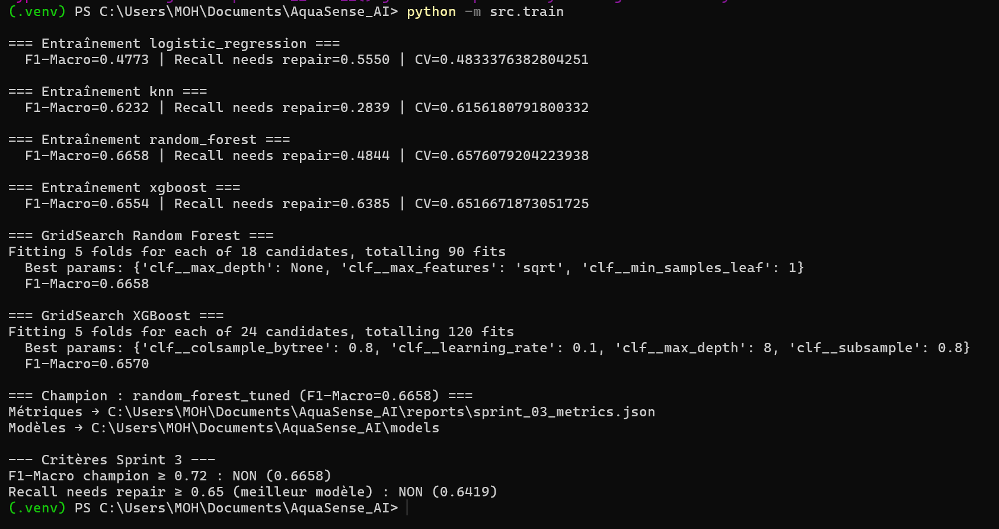
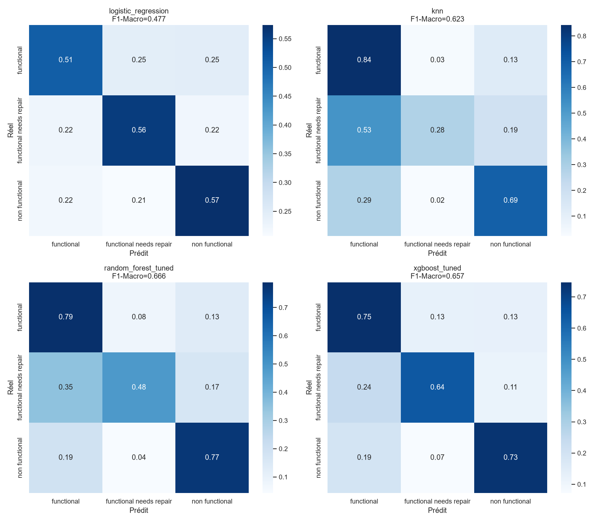
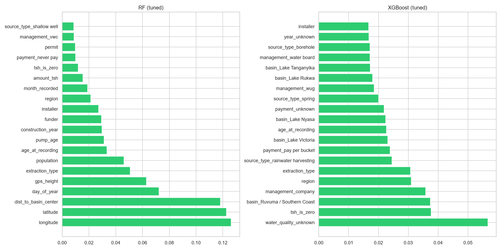

# Rapport Sprint 3 — Baseline ML

**Projet :** AquaSense AI · Maintenance prédictive forages & points d'eau · **Contexte Maroc**  
**Sprint :** S3 — Baseline ML (classifieurs classiques)  
**Date :** 2026-06-19  
**Équipe :** TRAORE Fanogo Mohamed · NADAHE Mohamed · EHTP MIG S4  
**Statut :** ✅ **Terminé** (entraînement local CPU — **pas besoin de Colab**)

---

## 1. Objectif du sprint

Entraîner et comparer **4 baselines ML** sur `train_clean.csv` (59 400 pompes, 26 features), avec tuning RF/XGBoost, pour établir une référence avant le Deep Learning (S4).

**Livrables produits :**
- `src/train.py` — split, `evaluate_model()`, 4 modèles, GridSearch RF/XGB, recall boost (SMOTE + seuil)
- `notebooks/03_ml_baseline.ipynb` — exécuté localement, graphiques exportés
- Modèles joblib dans `models/` (voir §8)
- `reports/sprint_03_metrics.json`, `sprint_03_model_comparison.csv`, `sprint_03_recall_boost.json`

---

## 2. Où tourne l'entraînement ? Local vs Colab

| Sprint | Runtime recommandé | Colab obligatoire ? |
|--------|-------------------|---------------------|
| **S3 — ML classique** (LR, KNN, RF, XGB) | **CPU local** (.venv) | **Non** — terminé en local |
| **S4 — Deep Learning** (MLP, CNN) | CPU local possible, **Colab GPU optionnel** si trop lent | Non obligatoire |

**Ce sprint (S3) est entièrement terminé sur ta machine.** Les modèles sont sauvegardés sur disque (`models/*.joblib`, datés 19/06/2026). Aucun entraînement n'est en cours — tu peux fermer le terminal ou passer au S4.

Colab n'est utile qu'à partir du **Sprint 4** si `python -m src.train_dl` est trop long sur CPU (~30 min à plusieurs heures selon le tuning).

---

## 3. Critères d'acceptation

| Critère | Cible | Résultat | Statut |
|---------|-------|----------|--------|
| 4+ modèles + GridSearch | Oui | 6 modèles (4 baselines + 2 tunés) | ✅ |
| Modèles sauvegardés | Oui | 5 fichiers `.joblib` | ✅ |
| Recall `needs repair` | ≥ 0.65 | **0.6952** (`xgboost_smote_threshold`) | ✅ |
| F1-Macro (champion RF) | ≥ 0.72 | **0.6658** | ❌ → objectif S4 (DL) |
| Notebook + graphiques | Oui | confusion + feature importance PNG | ✅ |

Le sprint est **livré**. Seul le F1-Macro global reste sous la cible — normal pour Pump It Up en ML classique sans DL.

---

## 4. Protocole expérimental

| Paramètre | Valeur |
|-----------|--------|
| Données | `data/cleaned/train_clean.csv` — 59 400 × 37 |
| Features | 26 colonnes (`PumpPreprocessor.get_feature_columns()`) |
| Split | 80/20 stratifié, `random_state=42` → 47 520 train / 11 880 test |
| Métrique principale | F1-Macro (3 classes équipondérées) |
| Métrique métier | Recall `functional needs repair` (classe minoritaire ~7 %) |
| CV | 5-fold stratifiée sur le train |

### Gestion du déséquilibre

| Modèle | Stratégie |
|--------|-----------|
| Logistic Regression | `class_weight='balanced'` |
| Random Forest | `class_weight='balanced'` |
| KNN | Aucune pondération (baseline géométrique) |
| XGBoost | `sample_weight` balanced |
| **Recall boost** | SMOTE (k=5) + seuil calibré sur hold-out 20 % du train |

### Encodage XGBoost

XGBoost 3.x n'accepte pas les labels string avec `sample_weight`. Wrapper `XGBStringLabelPipeline` : encode `y` en `[0,1,2]`, décode les prédictions en labels string.

---

## 5. Résultats — entraînement principal

### Capture terminal (`python -m src.train`)



*Champion F1-Macro : `random_forest_tuned` (0.6658). GridSearch RF : 90 fits, XGB : 120 fits — tous terminés avec succès.*

### Tableau comparatif

| Modèle | F1-Macro | F1 needs repair | Recall needs repair | Accuracy | ROC-AUC |
|--------|----------|-----------------|---------------------|----------|---------|
| **random_forest_tuned** 🏆 F1 | **0.6658** | 0.425 | 0.484 | 0.759 | 0.872 |
| xgboost_tuned | 0.6570 | 0.434 | 0.642 | 0.734 | 0.877 |
| xgboost | 0.6554 | 0.435 | 0.638 | 0.732 | 0.873 |
| knn | 0.6232 | 0.348 | 0.284 | 0.744 | 0.824 |
| logistic_regression | 0.4773 | 0.247 | 0.555 | 0.537 | 0.724 |

**GridSearch — hyperparamètres retenus :**

```python
# RF (identique aux défauts — plateau atteint)
{'clf__max_depth': None, 'clf__max_features': 'sqrt', 'clf__min_samples_leaf': 1}

# XGBoost
{'clf__colsample_bytree': 0.8, 'clf__learning_rate': 0.1,
 'clf__max_depth': 8, 'clf__subsample': 0.8}
```

---

## 6. Visualisations (notebook `03_ml_baseline.ipynb`)

### Matrices de confusion (normalisées)

Heatmaps des 4 modèles principaux : LR, KNN, RF tuned, XGB tuned. Permet de voir où chaque modèle confond `functional` / `needs repair` / `non functional`.



**Lecture :** RF confond souvent `needs repair` avec `functional` (recall 48 %). XGBoost détecte mieux la classe minoritaire mais avec plus de faux positifs.

### Feature importance (top 20)

Variables les plus influentes pour RF et XGBoost après encodage des catégorielles.



**Interprétation attendue :** `age_years`, `amount_tsh`, `longitude`/`latitude`, `wpt_name` (ordinal), `installer`/`funder` figurent souvent en tête — cohérent avec l'EDA Sprint 1 (âge, hydraulique, gestion).

---

## 7. Passe recall boost — critère métier atteint

Commande : `python -m src.train recall`

### Capture terminal


| Variante | F1-Macro | Recall needs repair | Seuil |
|----------|----------|---------------------|-------|
| **xgboost_smote_threshold** 🏆 métier | 0.6289 | **0.6952** | 0.16 |
| xgboost_threshold | 0.6392 | 0.6709 | 0.34 |
| random_forest_smote_threshold | 0.6317 | 0.6466 | 0.16 |
| xgboost_smote (sans seuil) | 0.6538 | 0.4519 | — |
| random_forest_smote | 0.6511 | 0.3975 | — |

**Enseignements :**
1. **SMOTE seul** ne suffit pas — le recall needs repair *baisse* pour XGB (0.45).
2. Le **seuil calibré** est la clé : même sans SMOTE, `xgboost_threshold` atteint 0.67 de recall.
3. **Champion métier Maroc** : `xgboost_smote_threshold` détecte ~**70 %** des pompes à réparer → `champion_recall_v1.joblib`.

### Deux champions selon l'objectif

| Usage | Modèle | Fichier | Métrique clé |
|-------|--------|---------|--------------|
| F1-Macro max | RF tuned | `champion_ml_v1.joblib` | 0.6658 |
| Détection `needs repair` | XGB SMOTE+seuil | `champion_recall_v1.joblib` | recall 0.6952 |

Arbitrage final prévu au **Sprint 5** (comparaison ML vs DL).

---

## 8. Analyse par classe (RF champion F1)

| Classe | Precision | Recall | F1 | Support test |
|--------|-----------|--------|-----|--------------|
| functional | 0.81 | 0.79 | 0.80 | 6 452 |
| functional needs repair | 0.38 | 0.48 | 0.43 | 863 |
| non functional | 0.78 | 0.77 | 0.77 | 4 565 |

Seulement **418 / 863** pompes « needs repair » correctement identifiées par le RF — d'où la passe recall boost.

---

## 9. Constats & limites

1. **Plafond ~0.67 F1-Macro** en ML classique sur Pump It Up — cohérent avec la littérature.
2. **Conflit métrique** documenté : F1-Macro vs recall métier → deux champions distincts.
3. **LR** inadaptée aux features mixtes (F1 = 0.48) — conservée comme baseline interprétable.
4. **KNN** : accuracy correcte mais recall needs repair très faible (0.28).
5. **F1 cible 0.72** reporté au Sprint 4 (Deep Learning).

---

## 10. Fichiers générés

```
models/
├── rf_best_v1.joblib              # Random Forest tuned (~342 Mo)
├── xgb_best_v1.joblib             # XGBoost tuned (~8 Mo)
├── champion_ml_v1.joblib          # Champion F1-Macro (RF)
├── champion_recall_v1.joblib      # Champion recall métier (XGB SMOTE+seuil)
└── xgb_smote_threshold_v1.joblib  # Variante recall boost

reports/
├── sprint_03_metrics.json
├── sprint_03_model_comparison.csv
├── sprint_03_recall_boost.json
├── sprint_03_recall_boost.csv
├── sprint_03_confusion_matrices.png
├── sprint_03_feature_importance.png
├── sprint_03_ml_report.md         # ce fichier
└── image/
    ├── image.png                  # capture terminal train
    └── Capture d'écran 2026-06-19 015451.png  # capture recall boost
```

**Reproduction :**
```powershell
python -m src.train          # baselines + GridSearch
python -m src.train recall   # recall boost
# ou notebook : notebooks/03_ml_baseline.ipynb
```

---

## 11. Prochaine étape — Sprint 4

**Deep Learning** (`python -m src.train_dl` ou `notebooks/04_dl_mlp.ipynb`) pour viser F1-Macro ≥ 0.72.

- **CPU local** : OK pour un premier essai (MLP seul, ~30 min).
- **Colab GPU** : optionnel si le tuning complet (`python -m src.train_dl tune`) est trop long.

---

*Rapport aligné sur les exécutions locales du 19/06/2026 — notebook `03_ml_baseline.ipynb` exécuté, modèles et PNG vérifiés sur disque.*
