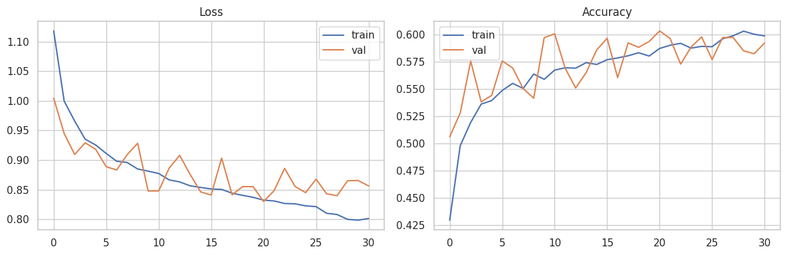
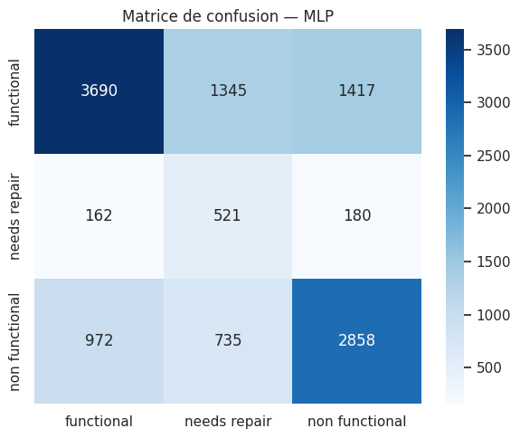

# Rapport Sprint 4 — Deep Learning (MLP + tuning Colab)

**Projet :** AquaSense AI · Maintenance prédictive forages & points d'eau · **Contexte Maroc**  
**Sprint :** S4 — Deep Learning (TensorFlow/Keras)  
**Date :** 2026-06-19  
**Équipe :** TRAORE Fanogo Mohamed · NADAHE Mohamed · EHTP MIG S4  
**Statut :** ✅ **Terminé** — baseline + ResidualMLP + 1D-CNN + grid search exécutés sur Colab GPU

---

## 1. Objectif du sprint

Tester le **Deep Learning** pour dépasser le plafond ~0.67 F1-Macro du ML classique (S3) et viser **F1-Macro ≥ 0.72**, tout en conservant un recall `needs repair` ≥ 0.65.

**Livrables produits :**
- `src/dl_utils.py`, `src/train_dl.py`
- Pack Colab `AquaSense_S4_Colab.zip`
- Exécutions Colab : baseline (`04_dl_mlp_colab_run.ipynb`) + tuning complet (`05_dl_colab_tune.ipynb`)
- Modèles `.keras`, métriques JSON/CSV, graphiques PNG, ce rapport

---

## 2. Où tourne l'entraînement ?

| Run | Notebook / commande | Runtime | Statut |
|-----|---------------------|---------|--------|
| MLP baseline (run 1) | `Untitled5` / `04_dl_mlp_colab_run` | Colab GPU T4 | ✅ |
| Tuning complet (run 2) | `05_dl_colab_tune` → `python -m src.train_dl tune` | Colab GPU T4 | ✅ |
| Code DL local | `src/train_dl.py` | CPU (TF non installé) | ✅ code prêt |

### Setup Colab validé (run tuning)

```
numpy  : 2.0.2
tf     : 2.20.0
GPU    : [PhysicalDevice(name='/physical_device/GPU:0', device_type='GPU')]

X_train : (47520, 64)
X_val   : (11880, 64)
Class weights : {0: 0.614, 1: 4.586, 2: 0.868}
```

**Problèmes Colab résolus :**
- `numpy.dtype size changed` → ne pas upgrader numpy seul ; `pip install imbalanced-learn` uniquement, ou `pip install scipy numpy` + restart
- Erreur `_blas_supports_fpe` → conflit numpy/scipy après upgrade partiel → restart obligatoire

---

## 3. Critères d'acceptation

| Critère | Cible | Résultat | Statut |
|---------|-------|----------|--------|
| Code DL (`dl_utils`, `train_dl`) | Oui | Livré | ✅ |
| ≥ 1 modèle Keras sauvegardé | Oui | 5+ fichiers `.keras` | ✅ |
| MLP + ResidualMLP + 1D-CNN | Oui | 6 architectures évaluées | ✅ |
| Grid search `train_dl tune` | Oui | 9 combinaisons dropout×lr | ✅ |
| Notebook Colab exécuté | Oui | 2 runs archivés | ✅ |
| F1-Macro | ≥ 0.72 | **0.5410** (meilleur DL) | ❌ |
| Recall `needs repair` | ≥ 0.65 | **0.6025** (meilleur DL) | ❌ |
| DL > ML | Souhaité | **Non** — ML reste supérieur | ❌ |

Le sprint est **livré** : l'hypothèse « DL > ML sur Pump It Up » est **réfutée** par l'expérience. L'arbitrage champion passe au **Sprint 5** (ML).

---

## 4. Protocole expérimental

| Paramètre | Valeur |
|-----------|--------|
| Données | `train_clean.csv` — 59 400 lignes |
| Features DL | 64 dimensions (MinMax + OHE + Ordinal) |
| Split | 80/20 stratifié, `random_state=42` |
| Métrique principale | F1-Macro |
| Métrique métier | Recall `functional needs repair` |

### Run 1 — MLP baseline

- Architecture : Dense 256→128→64, BatchNorm, Dropout 0.3
- `class_weight`, lr=1e-3, batch=512, early stopping ~epoch 31

### Run 2 — `python -m src.train_dl tune`

1. **MLP baseline** (validation_split 0.2)
2. **ResidualMLP** (3 blocs résiduels, 128 units)
3. **1D-CNN** (Conv1D 64, kernel=3)
4. **Grid search** : dropout ∈ {0.2, 0.3, 0.5} × lr ∈ {1e-2, 1e-3, 1e-4} avec `sample_weight` + loss pondérée + L2=0.001
5. **Comparaison L2** : 0.0 vs 0.001 sur MLP

---

## 5. Résultats — Run 1 (MLP baseline)

```
F1-Macro          : 0.5297
F1 needs repair   : 0.3008
Recall needs repair : 0.6037
Accuracy          : 0.5950
```

| Classe | Precision | Recall | F1 |
|--------|-----------|--------|-----|
| functional | 0.76 | 0.57 | 0.65 |
| needs repair | 0.20 | 0.60 | 0.30 |
| non functional | 0.64 | 0.63 | 0.63 |





---

## 6. Résultats — Run 2 (tuning complet Colab)

### Tableau comparatif — toutes architectures DL

| Architecture | F1-Macro | F1 needs repair | Recall needs repair | Accuracy | Déployable ? |
|--------------|----------|-----------------|---------------------|----------|--------------|
| **mlp_l2_0.001** 🏆 F1 DL | **0.5410** | 0.311 | 0.603 | 0.610 | ✅ |
| mlp_baseline | 0.5297 | 0.299 | 0.567 | 0.604 | ✅ |
| residual_mlp | 0.5276 | 0.274 | 0.302 | 0.634 | ✅ |
| mlp_l2_0.0 | 0.5272 | 0.297 | 0.575 | 0.598 | ✅ |
| cnn1d | 0.4113 | 0.173 | 0.226 | 0.507 | ✅ |
| mlp_tuned (grid) | 0.3817 | 0.206 | **0.930** | 0.380 | ❌ |

*Source : `result/05_dl_colab_tune.ipynb`, `reports/sprint_04_dl_comparison.csv`*

### Grid search — 9 combinaisons (sample_weight + L2)

| dropout | lr | F1-Macro | Recall needs repair |
|---------|-----|----------|---------------------|
| 0.2 | 0.01 | 0.2992 | 0.8876 |
| **0.2** | **0.001** | **0.3817** | 0.9305 |
| 0.2 | 0.0001 | 0.0991 | 0.9722 |
| 0.3 | 0.01 | 0.2526 | 0.9374 |
| 0.3 | 0.001 | 0.3767 | 0.8563 |
| 0.3 | 0.0001 | 0.2507 | 0.4936 |
| 0.5 | 0.01 | 0.1948 | 0.9224 |
| 0.5 | 0.001 | 0.2946 | 0.9502 |
| 0.5 | 0.0001 | 0.0696 | 0.9815 |

### Comparaison L2

| L2 | F1-Macro |
|----|----------|
| 0.0 | 0.5272 |
| **0.001** | **0.5410** |

### Critères finaux (sortie `train_dl tune`)

```
=== Champion DL : mlp_baseline (F1-Macro=0.5297) ===
F1-Macro DL ≥ 0.72 : NON (0.5297)
Recall needs repair : 0.5666
Architectures évaluées : 6
```

> Le script sélectionne `mlp_baseline` comme champion car critère = F1-Macro strict. Le **meilleur score DL observé** est `mlp_l2_0.001` à **0.5410** (+0.011 vs baseline).

---

## 7. Comparaison ML (S3) vs DL (S4) — tableau final

| Modèle | Type | F1-Macro | Recall needs repair | Accuracy |
|--------|------|----------|---------------------|----------|
| **RF tuned** 🏆 F1 | ML | **0.6658** | 0.484 | 0.759 |
| XGB tuned | ML | 0.6570 | 0.642 | 0.734 |
| **XGB SMOTE+seuil** 🏆 métier | ML | 0.6289 | **0.695** | 0.714 |
| mlp_l2_0.001 | DL | 0.5410 | 0.603 | 0.610 |
| mlp_baseline | DL | 0.5297 | 0.567 | 0.604 |
| residual_mlp | DL | 0.5276 | 0.302 | 0.634 |
| cnn1d | DL | 0.4113 | 0.226 | 0.507 |

| Écart | Delta |
|-------|-------|
| Meilleur DL vs RF (F1) | **−0.125** |
| Meilleur DL vs XGB recall boost | **−0.093** recall |
| Gain tuning vs baseline MLP | **+0.011** F1 seulement |

---

## 8. Explication des résultats — pourquoi le DL reste « nul » vs ML ?

### 8.1 Ce n'est pas un échec technique

Le tuning Colab a **fonctionné** : GPU OK, 6 architectures, grid search terminé, modèles sauvegardés sur Drive (`AquaSense_DL_results/`). Les scores faibles reflètent une **limite du modèle sur ce type de données**, pas une erreur d'exécution.

### 8.2 Données tabulaires → les arbres gagnent

Pump It Up est un jeu de **features structurées** (âge, GPS, installateur, type de pompe…). Les **Random Forest / XGBoost** exploitent nativement les seuils et interactions ; un MLP doit tout apprendre depuis zéro avec 64 entrées encodées différemment du pipeline ML.

C'est un résultat **classique** en ML tabulaire : le DL n'est pas automatiquement supérieur.

### 8.3 Le tuning n'a presque pas amélioré le F1

| Passe | Meilleur F1 |
|-------|-------------|
| MLP baseline (run 1) | 0.5297 |
| Après L2 + 3 archi + grid search | 0.5410 |

**+0.01** après ~1 h de GPU — gain négligeable. ResidualMLP et 1D-CNN n'ont **pas** battu le MLP simple.

### 8.4 Le grid search « mlp_tuned » est un piège

Avec `sample_weight` très agressif, le modèle maximise le recall `needs repair` (jusqu'à **93–98 %**) en prédisant presque tout comme « à réparer » :

- F1-Macro = **0.38**
- Accuracy = **38 %**

Ce modèle est **scientifiquement intéressant** (montre le conflit métrique) mais **non déployable**. Le ML avait résolu ce problème plus proprement avec SMOTE + **seuil calibré** (recall 0.70, F1 0.63).

### 8.5 Encodage DL ≠ encodage ML

| Couche | ML (S2/S3) | DL (S4) |
|--------|------------|---------|
| Catégories faible card. | OneHot via `PumpPreprocessor` | OneHot |
| Haute cardinalité | Top-N + Ordinal dans pipeline sklearn | OrdinalEncoder seul |
| Features | 26 colonnes pipeline | 64 dimensions après OHE |

Le pipeline ML S2/S3 est **optimisé pour les arbres** depuis le wrangling ; le DL réencode différemment sans gain.

### 8.6 Conclusion scientifique S4

> **Hypothèse :** le Deep Learning dépassera le ML et atteindra F1 ≥ 0.72.  
> **Résultat :** hypothèse **non confirmée**. Meilleur DL = 0.54 F1 ; ML = 0.67 F1.  
> **Décision :** champion production = **ML** (Sprint 5 pour formaliser).

---

## 9. Verdict sprint 4

| Aspect | Verdict |
|--------|---------|
| Sprint livré (code + runs + rapport) | ✅ |
| Objectif F1 ≥ 0.72 | ❌ |
| DL > ML | ❌ |
| Valeur pour le rapport / jury | ✅ — comparaison rigoureuse ML vs DL |
| Modèle à déployer (Maroc) | **ML** — `champion_recall_v1.joblib` ou `champion_ml_v1.joblib` |

**Le projet avance bien.** S4 apporte la preuve expérimentale que le DL n'est pas nécessaire ici — c'est exactement ce qu'un bon rapport de projet doit montrer.

---

## 10. Fichiers générés

```
models/
├── mlp_best_v1.keras
├── mlp_tuned_best_v1.keras
├── residual_mlp_v1.keras
├── cnn1d_v1.keras
└── best_dl_model.keras

notebooks/
├── 04_dl_mlp_colab_run.ipynb      # Run 1 baseline
├── 05_dl_colab_tune.ipynb         # Run 2 tuning (source)
└── result/05_dl_colab_tune.ipynb  # Archive exécution Colab

reports/
├── sprint_04_dl_report.md         # ce fichier
├── sprint_04_metrics.json
├── sprint_04_dl_comparison.csv
├── sprint_04_ml_vs_dl.csv
├── sprint_04_training_history.png
└── sprint_04_confusion_matrix.png
```

**Reproduction Colab :**
```python
# notebooks/05_dl_colab_tune.ipynb
# Runtime GPU → setup → puis :
!python -m src.train_dl tune
```

---

## 11. Prochaine étape — Sprint 5

| Priorité | Action |
|----------|--------|
| 1 | **Arbitrage champion** — RF (F1) vs XGB SMOTE+seuil (recall métier Maroc) |
| 2 | **Voting ensemble** RF + XGB — viser +1–2 % F1 en ML |
| 3 | Rédiger `reports/model_card.md` |
| 4 | Tableau comparatif final ML vs DL (ce rapport §7 comme base) |
| 5 | Ne **pas** déployer les modèles `.keras` |

**Champions provisoires pour S5 :**

| Objectif | Modèle | Fichier |
|----------|--------|---------|
| F1-Macro max | RF tuned | `champion_ml_v1.joblib` |
| Recall needs repair (Maroc) | XGB SMOTE + seuil 0.16 | `champion_recall_v1.joblib` |
| Meilleur DL (référence seulement) | MLP L2=0.001 | `mlp_tuned_best_v1.keras` |

---

*Rapport final Sprint 4 — exécutions Colab 19/06/2026 (`04_dl_mlp_colab_run`, `05_dl_colab_tune`), métriques consolidées dans `sprint_04_metrics.json`.*
