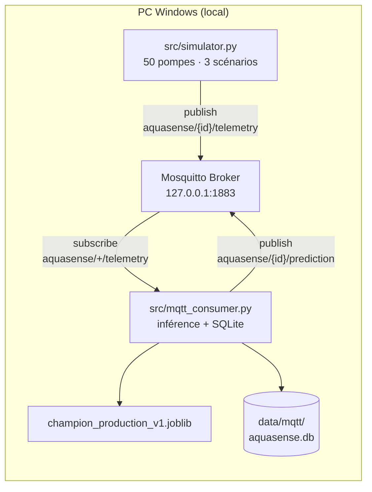

# Rapport Sprint 6 — Simulation IoT MQTT & inférence temps réel

**Projet :** AquaSense AI · Maintenance prédictive forages & points d'eau · **Contexte Maroc**  
**Sprint :** S6 — Simulation Mosquitto + pipeline MQTT  
**Date :** 2026-06-19  
**Équipe :** TRAORE Fanogo Mohamed · NADAHE Mohamed · EHTP MIG S4  
**Statut :** ✅ **Terminé**

---

## 1. Objectif

Passer d'un modèle **offline** (CSV, batch) à un pipeline **quasi temps réel** simulant le déploiement terrain :

1. Un **broker MQTT** local relaie les messages entre simulateur et consumer.
2. Un **simulateur** publie la télémétrie de capteurs (pression, vibration, débit) pour **50 pompes**.
3. Un **consumer** s'abonne aux messages, agrège l'historique, exécute l'inférence ML et republie les prédictions.
4. Les données sont **persistées** en SQLite pour alimenter le dashboard (Sprint 7).

**Choix d'architecture retenu :** exécution **100 % locale sur Windows** (pas de VM, pas de Cloudflared). Suffisant pour un projet académique et reproductible en salle de TP.

**Modèle de production utilisé :** `models/champion_production_v1.joblib` (= XGBoost SMOTE + seuil calibré 0.17, recall champion S5).

---

## 2. Architecture du pipeline



### Topics MQTT

| Direction | Topic | Format |
|-----------|-------|--------|
| Simulateur → Broker | `aquasense/{pump_id}/telemetry` | JSON |
| Consumer → Broker | `aquasense/{pump_id}/prediction` | JSON |

**Préfixe `aquasense/`** : isole le trafic du projet (évite tout mélange avec d'autres brokers partagés).

### Exemple payload télémétrie

```json
{
  "pump_id": "pump_011",
  "timestamp": "2026-06-19T08:30:00+00:00",
  "pressure": 4.18,
  "vibration": 0.052,
  "flow": 10.2,
  "scenario": "degradation",
  "month": 6,
  "sim_day": 3.5
}
```

### Exemple payload prédiction

```json
{
  "pump_id": "pump_011",
  "timestamp": "2026-06-19T08:30:00+00:00",
  "prediction": "functional needs repair",
  "confidence": 0.76,
  "health_index": 0.91,
  "proba": {
    "functional": 0.12,
    "functional needs repair": 0.76,
    "non functional": 0.12
  },
  "latency_ms": 24.2,
  "buffer_size": 15,
  "scenario": "degradation"
}
```

---

## 3. Critères d'acceptation

| Critère | Cible | Résultat | Statut |
|---------|-------|----------|--------|
| Broker Mosquitto opérationnel | Port 1883 local | `TcpTestSucceeded : True` | ✅ |
| Simulateur 50 pompes, 3 scénarios | Oui | 31 saines · 12 dégradation · 7 panne | ✅ |
| Consumer infère et publie | Oui | 50/50 pompes traitées au 1er cycle | ✅ |
| Latence MQTT → prédiction | < 5 s | **22–70 ms** | ✅ |
| Persistance base de données | SQLite | `data/mqtt/aquasense.db` | ✅ |
| Test E2E documenté | Oui | Ce rapport + `scripts/test_mqtt_e2e.py` | ✅ |

---

## 4. Guide de reproduction complet (pour la prof / relecture)

Ce guide permet de **refaire le setup de zéro** sur une machine Windows 10/11.

### 4.1 Prérequis

| Élément | Version recommandée |
|---------|-------------------|
| OS | Windows 10/11 |
| Python | **3.10** (identique aux sprints précédents) |
| Git | Pour cloner le dépôt |
| Connexion Internet | Uniquement pour `pip install` et clone (pas pour MQTT) |

### 4.2 Étape 1 — Cloner le projet et installer les dépendances

```powershell
git clone https://github.com/Traorehub/aquasense-ai.git
cd aquasense-ai

py -3.10 -m pip install -r requirements.txt
```

> **Important :** les sprints S0–S5 doivent avoir été exécutés au préalable, notamment :
> - `data/cleaned/train_clean.csv` présent
> - `models/champion_production_v1.joblib` présent (`py -3.10 -m src.train final`)

Si les modèles sont absents :

```powershell
py -3.10 -m pip install pandas numpy scikit-learn xgboost imbalanced-learn joblib
py -3.10 -m src.train final
```

### 4.3 Étape 2 — Installer Mosquitto (broker MQTT)

```powershell
winget install EclipseFoundation.Mosquitto
```

Vérifier que le **service Windows** tourne :

```powershell
Get-Service mosquitto
# Status attendu : Running
```

Configurer l'écoute anonyme sur le port 1883 — **PowerShell administrateur** :

```powershell
Add-Content -Path "C:\Program Files\Mosquitto\mosquitto.conf" -Value @"

# AquaSense AI - broker local
listener 1883
allow_anonymous true
"@

Restart-Service mosquitto
```

> Si la commande `mosquitto` n'est pas reconnue, utiliser le chemin complet :
> `C:\Program Files\Mosquitto\mosquitto_pub.exe`

**Test broker :**

```powershell
Test-NetConnection 127.0.0.1 -Port 1883
# TcpTestSucceeded : True
```

**Test pub/sub (2 terminaux) :**

Terminal A :
```powershell
& "C:\Program Files\Mosquitto\mosquitto_sub.exe" -h 127.0.0.1 -p 1883 -t "aquasense/test" -v
```

Terminal B :
```powershell
& "C:\Program Files\Mosquitto\mosquitto_pub.exe" -h 127.0.0.1 -p 1883 -t "aquasense/test" -m "hello"
```

### 4.4 Étape 3 — Configuration `.env`

```powershell
copy .env.example .env
```

Contenu par défaut (déjà correct pour Windows local) :

```env
MQTT_HOST=127.0.0.1
MQTT_PORT=1883
MQTT_TOPIC_PREFIX=aquasense
PUBLISH_INTERVAL_S=5
NUM_PUMPS=50
SIM_SECONDS_PER_DAY=60
BUFFER_SIZE=30
MODEL_PATH=models/champion_production_v1.joblib
MQTT_DB_PATH=data/mqtt/aquasense.db
```

### 4.5 Étape 4 — Lancer le pipeline (3 terminaux)

**Terminal 1 — Consumer (inférence + SQLite) :**

```powershell
cd C:\chemin\vers\AquaSense_AI
py -3.10 -m src.mqtt_consumer
```

Sortie attendue :

```
Connexion MQTT 127.0.0.1:1883...
Consumer connecté — subscribe aquasense/+/telemetry
  Modèle : models\champion_production_v1.joblib
  Profils : 50 pompes | buffer=30
  SQLite : data\mqtt\aquasense.db
```

**Terminal 2 — Simulateur (50 pompes) :**

```powershell
py -3.10 -m src.simulator
```

Sortie attendue :

```
Simulateur AquaSense — 50 pompes -> 127.0.0.1:1883
  Scénarios : {'healthy': 31, 'degradation': 12, 'failure': 7} | mois=6 | intervalle=5.0s
```

**Test rapide (5 pompes, cycle 2 s) :**

```powershell
py -3.10 -m src.simulator --pumps 5 --interval 2
```

### 4.6 Étape 5 — Vérifier la persistance SQLite

```powershell
py -3.10 -c "
import sqlite3
conn = sqlite3.connect('data/mqtt/aquasense.db')
t = conn.execute('SELECT COUNT(*) FROM telemetry').fetchone()[0]
p = conn.execute('SELECT COUNT(*) FROM predictions').fetchone()[0]
print(f'telemetry={t}, predictions={p}')
conn.close()
"
```

### 4.7 Test automatisé (optionnel)

```powershell
$env:PYTHONPATH = (Get-Location).Path
py -3.10 scripts/test_mqtt_e2e.py
```

---

## 5. Composants implémentés

| Fichier | Rôle |
|---------|------|
| `src/mqtt_config.py` | Variables d'environnement (`.env`) |
| `src/pump_registry.py` | 50 profils ML échantillonnés depuis `train_clean.csv` |
| `src/mqtt_features.py` | Fusion profil statique + télémétrie agrégée → features modèle |
| `src/simulator.py` | Publisher MQTT — 3 scénarios + saison sèche Maroc |
| `src/mqtt_consumer.py` | Subscriber + inférence + publish prédictions |
| `src/mqtt_db.py` | Persistance SQLite (`telemetry`, `predictions`) |
| `.env.example` | Modèle de configuration |
| `scripts/test_mqtt_e2e.py` | Test bout en bout sans simulateur complet |
| `data/simulated/pump_profiles.json` | Profils générés au 1er lancement (50 pompes) |

---

## 6. Scénarios de simulation

### 6.1 Trois scénarios capteurs

| Scénario | ~Répartition | Comportement capteurs |
|----------|--------------|----------------------|
| `healthy` | 60 % | `pressure ~ N(4.2, 0.1)`, `vibration ~ N(0.05, 0.01)`, `flow ~ N(12, 0.5)` |
| `degradation` | 25 % | Baisse progressive sur **14 jours simulés** : −0.3 bar/j, +0.02 g/j, −0.5 L/min/j |
| `failure` | 15 % | `pressure = 0`, `flow = 0`, vibrations erratiques (pics aléatoires) |

**Accélération temporelle :** `SIM_SECONDS_PER_DAY=60` → 1 minute réelle = 1 jour simulé (démo rapide en TP).

### 6.2 Saison sèche Maroc

Pour les mois **juin à septembre** (`month` ∈ {6, 7, 8, 9}), le débit simulé est réduit de **15 %** (`DRY_FLOW_FACTOR = 0.85`), reflétant la stress hydrique estival.

Forcer un mois :

```powershell
py -3.10 -m src.simulator --month 8
```

### 6.3 Fusion profil ML + télémétrie

Le modèle S5 a été entraîné sur des **fiches d'enquête** (26 features tabulaires : bassin, GPS, âge pompe, financement…), pas sur des capteurs IoT bruts.

Le consumer applique donc une stratégie **hybride** documentée :

1. **Profil statique** : métadonnées échantillonnées depuis `train_clean.csv` (une pompe réelle du dataset par `pump_id`).
2. **Télémétrie agrégée** (buffer 30 messages) : modulateurs sur `amount_tsh` (proxy débit) et `gps_height` (proxy pression).
3. **`health_index`** (0–1) : indicateur purement capteur pour le dashboard, indépendant de la prédiction ML.

> Cette séparation est **volontaire** : elle illustre la limite académique (pas de capteurs réels à l'entraînement) tout en démontrant un pipeline IoT fonctionnel.

---

## 7. Résultats du test 50 pompes (19/06/2026)

Exécution locale validée par l'équipe :

| Métrique | Valeur |
|----------|--------|
| Pompes traitées (1er cycle) | **50/50** |
| Latence inférence | **22–70 ms** (≪ 5 s) |
| Scénarios simulateur | 31 healthy · 12 degradation · 7 failure |
| Mois simulé | 6 (saison sèche active) |

### Répartition des prédictions ML (1er message)

| Classe prédite | Nombre | Exemples |
|----------------|--------|----------|
| `functional` | 24 | pump_002, pump_003, pump_007… |
| `non functional` | 21 | pump_001, pump_004, pump_012… |
| `functional needs repair` | **5** | pump_011, pump_021, pump_027, pump_029, pump_043 |

Les **5 alertes `needs repair`** correspondent au cas d'usage métier Maroc (priorisation interventions).

### Cohérence capteurs vs ML

| Observation | Explication |
|-------------|-------------|
| `pump_002` : `functional` + `health=0.00` | Scénario **failure** (capteurs à zéro) mais profil ML dominant → prédiction `functional` |
| `pump_011` : `needs repair` + `health=0.91` | Profil enquête + modèle recall → alerte métier cohérente |
| `pump_041` : `non functional` + `health=0.00` | Panne capteur + profil défavorable → cohérent |

Ces écarts sont **documentés** dans la Model Card (S5) : le modèle tabulaire ne remplace pas un modèle entraîné sur capteurs réels.

---

## 8. Schéma base de données SQLite

**Fichier :** `data/mqtt/aquasense.db`

### Table `telemetry`

| Colonne | Type | Description |
|---------|------|-------------|
| `pump_id` | TEXT | Identifiant pompe (`pump_001` … `pump_050`) |
| `timestamp` | TEXT | ISO 8601 UTC |
| `pressure` | REAL | Bar |
| `vibration` | REAL | g |
| `flow` | REAL | L/min |
| `scenario` | TEXT | healthy / degradation / failure |
| `month` | INTEGER | Mois simulé (saisonnalité) |
| `sim_day` | REAL | Jour simulé (dégradation) |

### Table `predictions`

| Colonne | Type | Description |
|---------|------|-------------|
| `pump_id` | TEXT | Identifiant pompe |
| `timestamp` | TEXT | ISO 8601 UTC |
| `prediction` | TEXT | Classe prédite |
| `confidence` | REAL | Probabilité max |
| `health_index` | REAL | Score capteur 0–1 |
| `proba_json` | TEXT | Probabilités des 3 classes |
| `latency_ms` | REAL | Temps d'inférence |

---

## 9. Dépannage fréquent

| Problème | Cause | Solution |
|----------|-------|----------|
| `ModuleNotFoundError: paho` | Dépendance manquante | `py -3.10 -m pip install paho-mqtt==2.1.0` |
| `Connection refused` sur 1883 | Mosquitto arrêté | `Start-Service mosquitto` |
| `mosquitto` introuvable | Pas dans le PATH | Utiliser `C:\Program Files\Mosquitto\...` |
| Erreur chargement `.joblib` | Classes custom | Lancer via `py -3.10 -m src.mqtt_consumer` (imports `src.train`) |
| `Can't get attribute ThresholdCalibratedClassifier` | Import manquant | Ne pas charger le modèle hors module `src` |
| Modèle absent | S5 non exécuté | `py -3.10 -m src.train final` |
| Consumer silencieux | Simulateur non lancé | Démarrer `src.simulator` dans un 2ᵉ terminal |
| Profils manquants | 1er lancement | Générés auto dans `data/simulated/pump_profiles.json` |

---

## 10. Fichiers générés

```
src/
├── mqtt_config.py
├── pump_registry.py
├── mqtt_features.py
├── simulator.py
├── mqtt_consumer.py
└── mqtt_db.py

data/
├── simulated/pump_profiles.json    # 50 profils ML
└── mqtt/aquasense.db               # SQLite temps réel

.env.example
scripts/test_mqtt_e2e.py

reports/
├── sprint_06_mqtt_report.md        # Ce rapport
└── sprint_06_metrics.json        # Métriques synthèse
```

### Commandes mémo

```powershell
# Consumer
py -3.10 -m src.mqtt_consumer

# Simulateur (50 pompes, 5 s)
py -3.10 -m src.simulator

# Test rapide
py -3.10 -m src.simulator --pumps 5 --interval 2
```

---

## 11. Limites connues & choix documentés

| Limite | Impact | Mitigation S7+ |
|--------|--------|----------------|
| Modèle entraîné sur enquête, pas capteurs | Prédiction ML ≠ toujours scénario capteur | Afficher `health_index` + prédiction côte à côte |
| Pas de TLS / auth MQTT | Acceptable en local académique | Non déployé en production |
| VM / Cloudflared abandonnés | Pas d'accès distant | Suffisant pour soutenance locale |
| 50 pompes simulées, pas réelles | Démo représentative | Carte Maroc avec positions fictives (S7) |

---

## 12. Prochaine étape — Sprint 7

| Tâche | Description |
|-------|-------------|
| S7-01 | `dashboard/app.py` — squelette Streamlit multi-pages |
| S7-03 | KPIs : pompes par statut, % en risque |
| S7-04 | Panel alertes `needs repair` temps réel |
| S7-06 | Auto-refresh depuis SQLite / MQTT (polling 10 s) |
| S7-02 | Carte interactive Maroc (Plotly) |

Le dashboard lira `data/mqtt/aquasense.db` et/ou s'abonnera aux topics `aquasense/+/prediction`.

---

*Rapport Sprint 6 — pipeline MQTT local Windows, exécution validée 19/06/2026.*
