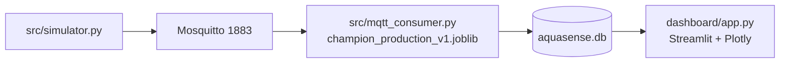

# Rapport Sprint 7 — Dashboard Streamlit (vue Maroc)

**Projet :** AquaSense AI · Maintenance prédictive forages & points d'eau · **Contexte Maroc**  
**Sprint :** S7 — Dashboard opérationnel alimenté par SQLite (pipeline MQTT S6)  
**Date :** 2026-06-19  
**Équipe :** TRAORE Fanogo Mohamed · NADAHE Mohamed · EHTP MIG S4  
**Statut :** ✅ **Terminé**

---

## 1. Objectif

Construire une **interface de supervision** pour visualiser en temps quasi réel l'état des 50 pompes simulées :

1. **KPIs** agrégés (opérationnelles, maintenance requise, hors service, volume MQTT).
2. **Carte Maroc** avec statuts ML colorés.
3. **Panel alertes** et assignation technicien (démo métier).
4. **Détail pompe** : télémétrie MQTT + prédiction + latence inférence.
5. **Comparaison modèles** S3–S5 (arbitrage documenté).

**Source de données :** `data/mqtt/aquasense.db` (SQLite alimenté par `src/mqtt_consumer.py`), rafraîchissement auto **10 s**.

---

## 2. Architecture dashboard



| Composant | Fichier | Rôle |
|-----------|---------|------|
| Chargement données | `dashboard/data.py` | Fusion profils + dernières prédictions SQLite |
| Interface | `dashboard/app.py` | 5 pages, thème AquaSense, auto-refresh |
| Thème | `dashboard/theme.py` + `.streamlit/config.toml` | Palette eau / bleu profond |
| Positions carte | `MOROCCO_SITES` dans `data.py` | **Démo** : localités rurales marocaines |

> **Important :** la carte utilise des positions **démo** sur localités marocaines. Les profils ML et l'inférence MQTT restent sur le proxy **Pump It Up (Tanzanie)**. Voir [choix_dataset_maroc.md](./choix_dataset_maroc.md).

---

## 3. Critères d'acceptation

| Critère | Cible | Résultat | Statut |
|---------|-------|----------|--------|
| Dashboard Streamlit fonctionnel | 5 pages | Vue d'ensemble · Alertes · Détail · Modèles · À propos | ✅ |
| Données temps réel SQLite | Oui | Pipeline actif, auto-refresh 10 s | ✅ |
| KPIs 50 pompes | Oui | 24 op. · 5 maintenance · 21 hors service | ✅ |
| Carte géographique Maroc | Oui | OpenStreetMap + légende ML | ✅ |
| Panel alertes | Oui | 5 pompes `needs repair` + assignation | ✅ |
| Comparaison modèles S5 | Oui | Tableau + radar top 6 | ✅ |
| Captures probantes | Oui | 6 captures (Modèles = 2 vues) | ✅ |

---

## 4. Lancement (venv)

```powershell
cd C:\Users\MOH\Documents\AquaSense_AI
.\.venv\Scripts\Activate.ps1
python -m src.mqtt_consumer      # terminal 1
python -m src.simulator          # terminal 2
python -m streamlit run dashboard/app.py   # terminal 3 → http://localhost:8501 ou 8502
```

---

## 5. Captures dashboard (19/06/2026)

Pipeline MQTT actif pendant les captures : **~107 578 messages** · **~107 577 inférences** · latence moyenne **~34 ms**.

### 5.1 Vue d'ensemble


*Bandeau pipeline actif · 50 pompes · carte avec légende ML (vert / orange / rouge) · répartition 48 % / 10 % / 42 % · 5 alertes prioritaires.*

### 5.2 Panel alertes


*5 pompes `functional needs repair` : pump_021 (Rabat-Salé-Kénitra, 85 %), pump_043 (Drâa-Tafilalet, 72 %), etc. · formulaire assignation technicien.*

### 5.3 Détail pompe


*Exemple `pump_003` · Souss-Massa · statut opérationnel · confiance 94 % · latence 51 ms · courbes pression / débit simulées.*

### 5.4 Comparaison modèles (2 captures — page longue)

**Capture 1 — tableau comparatif (haut de page)**


*Top modèles : `voting_rf_xgb_soft` (F1-Macro 0,6787), `random_forest`, `xgboost_tuned`…*

**Capture 2 — suite tableau + radar (bas de page)**


*Radar F1-Macro vs Recall maintenance · rappel : production MQTT = `champion_production_v1.joblib` · analytics = `voting_rf_xgb_soft`.*

### 5.5 À propos / pipeline


*Documentation pipeline : simulateur → MQTT → inférence → SQLite → dashboard · compteurs temps réel · équipe EHTP MIG S4.*

---

## 6. Synthèse métriques (session capture)

| Métrique | Valeur |
|----------|--------|
| Pompes suivies | **50** |
| Opérationnelles (`functional`) | **24** |
| Maintenance requise (`needs repair`) | **5** |
| Hors service (`non functional`) | **21** |
| Messages MQTT en base | **107 578** |
| Inférences enregistrées | **107 577** |
| Latence moyenne inférence | **~34 ms** |
| Modèle production MQTT | `champion_production_v1.joblib` |

### Alertes métier (5 pompes)

| Pompe | Région (carte démo) |
|-------|---------------------|
| pump_021 | Rabat-Salé-Kénitra |
| pump_043 | Drâa-Tafilalet |
| pump_027 | Fès-Meknès |
| pump_029 | Fès-Meknès |
| pump_011 | Béni Mellal-Khénifra |

*Confiance et latence : voir capture §5.2.*

---

## 7. Limites documentées (cadrage Maroc)

| Élément | Réalité projet |
|---------|----------------|
| GPS carte | Positions **démo** sur localités marocaines (affichage uniquement) |
| Profils ML / inférence | Proxy **Pump It Up (Tanzanie)** — inchangé |
| `latitude` / `longitude` dans le modèle | Features d'entraînement TZ ; pas remplacées par GPS Maroc réel |
| Déploiement terrain Maroc | Nécessiterait données ONEE/ABH + ré-entraînement cohérent |

---

## 8. Livrables Sprint 7

| Fichier | Description |
|---------|-------------|
| `dashboard/app.py` | Application Streamlit (5 pages) |
| `dashboard/data.py` | Chargement SQLite + sites carte Maroc |
| `dashboard/theme.py` | Thème visuel AquaSense |
| `.streamlit/config.toml` | Configuration thème Streamlit |
| `reports/image/Capture d'écran 2026-06-19 145330.png` | Vue d'ensemble |
| `reports/image/Capture d'écran 2026-06-19 145829.png` | Alertes |
| `reports/image/Capture d'écran 2026-06-19 150248.png` | Détail pompe |
| `reports/image/Capture d'écran 2026-06-19 150314.png` | Modèles (1/2) |
| `reports/image/Capture d'écran 2026-06-19 150330.png` | Modèles (2/2) |
| `reports/image/Capture d'écran 2026-06-19 150357.png` | À propos |

---

## 9. Prochaine étape

**Sprint 8** — Tests E2E automatisés (`scripts/test_mqtt_e2e.py`) et validation bout-en-bout simulateur → consumer → dashboard.

---

*Rapport validé par l'équipe · EHTP MIG S4 · 2026-06-19*
