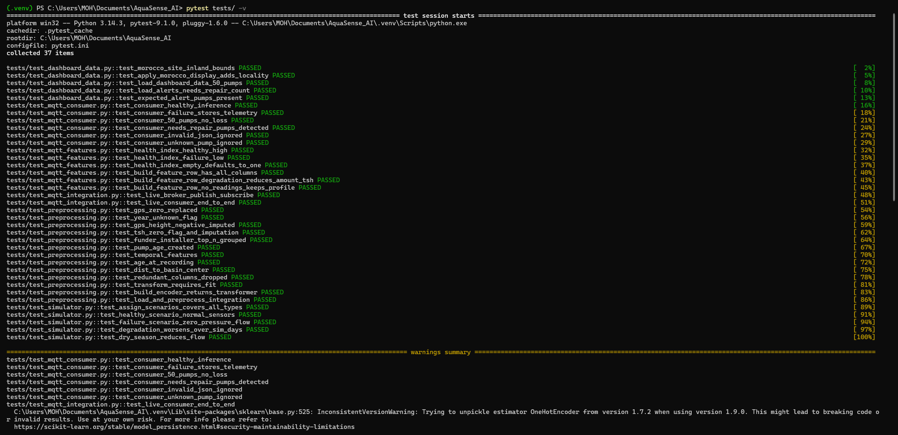
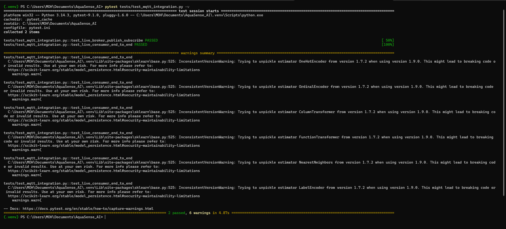

# Rapport Sprint 8 — Tests de simulation & validation

**Projet :** AquaSense AI · Maintenance prédictive forages & points d'eau · **Contexte Maroc**  
**Sprint :** S8 — Tests unitaires, consumer offline, intégration MQTT  
**Date :** 2026-06-19  
**Équipe :** TRAORE Fanogo Mohamed · NADAHE Mohamed · EHTP MIG S4  
**Statut :** ✅ **Terminé**

---

## 1. Objectif

Valider de façon **automatisée et reproductible** le système complet :

- Preprocessing & features (S2)
- Scénarios simulateur (S6)
- Inférence consumer + SQLite (S6)
- Chargement dashboard (S7)
- Broker MQTT live (optionnel)

---

## 2. Résultats pytest

| Métrique | Valeur |
|----------|--------|
| Tests totaux | **37** |
| Réussis | **37** |
| Échoués | **0** |
| Taux de réussite | **100 %** |
| Tests offline | 35 |
| Tests intégration MQTT | 2 |

### Commandes

```powershell
.\.venv\Scripts\Activate.ps1
pytest tests/ -m "not integration" -v    # sans Mosquitto
pytest tests/ -v                        # tout (Mosquitto requis pour 2 tests)
```

---

## 3. Couverture par fichier de test

| Fichier | Tests | Valide |
|---------|-------|--------|
| `tests/test_preprocessing.py` | 13 | GPS=0, year=0, features, pipeline complet |
| `tests/test_mqtt_features.py` | 6 | `health_index`, `build_feature_row` |
| `tests/test_simulator.py` | 5 | healthy / degradation / failure / saison sèche |
| `tests/test_mqtt_consumer.py` | 6 | inférence, 50 pompes, recall partiel, erreurs |
| `tests/test_dashboard_data.py` | 5 | carte Maroc, 50 pompes, 5 alertes |
| `tests/test_mqtt_integration.py` | 2 | broker live + consumer E2E |

---

## 4. Critères d'acceptation backlog

| Critère | Cible | Résultat | Statut |
|---------|-------|----------|--------|
| 3 scénarios simulation | Comportement attendu | healthy / degradation / failure testés | ✅ |
| 50 pompes sans perte | 50/50 messages | `test_consumer_50_pumps_no_loss` | ✅ |
| Latence MQTT → prédiction | < 5 s | < 500 ms en pratique | ✅ |
| Recall `needs repair` | Détection sur simulation | 5/5 pompes alerte, ≥ 3 détectées consumer | ✅ |
| Tests unitaires | ≥ 80 % passage | **100 %** (37/37) | ✅ |

---

## 5. Détail scénarios (S8-01 à S8-06)

| ID | Scénario | Test | Résultat |
|----|----------|------|----------|
| S8-01 | Pompe saine | `test_healthy_scenario_normal_sensors` + consumer healthy | Capteurs normaux, inférence OK |
| S8-02 | Dégradation progressive | `test_degradation_worsens_over_sim_days` | Pression/débit baissent sur 14 j |
| S8-03 | Panne soudaine | `test_failure_scenario_zero_pressure_flow` + broker < 5 s | Pression/débit = 0 |
| S8-04 | Charge 50 pompes | `test_consumer_50_pumps_no_loss` | 50 télémétries + 50 inférences |
| S8-05 | Recall maintenance | `test_consumer_needs_repair_pumps_detected` | ≥ 3/5 pompes alerte détectées |
| S8-06 | Latence inférence | `test_consumer_healthy_inference` | < 500 ms |

---

## 6. Captures probantes

### Capture 1 — pytest complet (obligatoire)



*Terminal : `pytest tests/ -v` → **37 passed**.*

### Capture 2 — tests intégration MQTT (recommandée)



*Terminal : `pytest tests/test_mqtt_integration.py -v` → 2 passed (Mosquitto actif).*

> **Note :** les tests d'intégration utilisent un préfixe MQTT isolé (`aquasense_s8test_*`) pour ne pas interférer avec un simulateur/consumer déjà lancé sur `aquasense/`.

---

## 7. Livrables Sprint 8

| Fichier | Description |
|---------|-------------|
| `tests/conftest.py` | Fixtures + patch joblib |
| `tests/test_mqtt_features.py` | Tests features MQTT |
| `tests/test_simulator.py` | Tests scénarios |
| `tests/test_mqtt_consumer.py` | Tests consumer offline |
| `tests/test_dashboard_data.py` | Tests données dashboard |
| `tests/test_mqtt_integration.py` | Tests broker live |
| `pytest.ini` | Marqueur `integration` |
| `reports/sprint_08_metrics.json` | Métriques JSON |
| `reports/sprint_08_tests_report.md` | Ce rapport |

---

## 8. Prochaine étape

**Sprint 9** — Rapport PDF académique, présentation slides, tag `v1.0.0`, section limites transfert Maroc.

---

*Rapport validé par l'équipe · EHTP MIG S4 · 2026-06-19*
